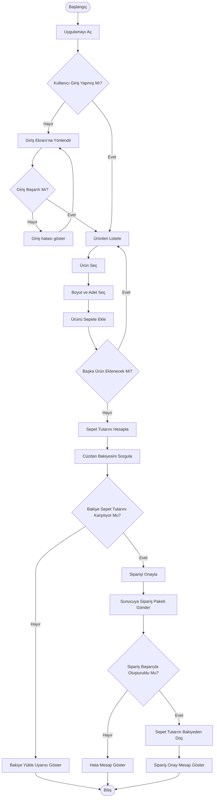

**GÖREV 1: Kahve Sipariş Akış Şeması**

**GÖREV 2: REST API Uç Noktası ve JSON Tasarımı**

**1. Sipariş Oluşturma Endpoint’i**

**HTTP Metodu:** POST

**URL / Endpoint:** /api/v1/siparisler

**Header’lar:**

- Authorization: Bearer <token>

- Content-Type: application/json

**Örnek Request Body:**

    {

      "urunler": [

    	{

    		"kahveAdi": "Latte",

    		"boyut": "Grande",

    		"adet": 2,

    		"birimFiyat": 85.5

    	},

    	{

    		"kahveAdi": "Americano",

    		"boyut": "Tall",

    		"adet": 1,

    		"birimFiyat": 60.0

    	}

    	],

    	"toplamTutar": 231.0,

    	"paraBirimi": "TRY"

    }

**Başarılı Sonuç:** HTTP/1.1 201 Created

**Örnek Başarılı Response:**

    {

      "siparisId": "KG-20260915-001",

      "durum": "ONAYLANDI",

      "toplamTutar": 231.0,

      "paraBirimi": "TRY",

      "mesaj": "Siparişiniz Başarıyla Oluşturuldu."

    }

**Kullanıcı Giriş Yapmamışsa:** HTTP/1.1 401 Unauthorized

**Örnek Yetkilendirme Hatası Response:**

    {

      "hata": "UNAUTHORIZED",

      "mesaj": "Sipariş Oluşturmak için Giriş Yapmalısınız!"

    }

**2. Cüzdan Bakiye Sorgulama Endpoint’i**

**HTTP Metodu:** GET

**URL / Endpoint:** /api/v1/kullanici/bakiye

**Header:** Authorization: Bearer <token>

**Örnek Başarılı Response:**

    {

      "bakiye": 185.50,

      "paraBirimi": "TRY"

    }

**Başarılı HTTP Durum Kodu:** HTTP/1.1 200 OK

**Sunucuda Beklenmeyen Hata Oluşursa:** HTTP/1.1 500 Internal Server Error

**Örnek Hata Response:**

    {

      "hata": "INTERNAL_SERVER_ERROR",

      "mesaj": "Sunucuda beklenmeyen bir hata oluştu."

    }

**Mini Mülakat Sorusu**

**GET = Idempotent. Aynı İstek Tekrarlandığında Yalnızca Veriyi Okur ve Sistem Durumunu Değiştirmez. POST İsteği Genel Olarak Idempotent Değildir; Aynı Sipariş İsteği Birden Fazla Gönderildiğinde Birden Fazla Sipariş Oluşturulabilir.**

**GÖREV 3**

**1. SRP İhlali**

KahveSiparisYoneticisi Sınıfı; Sepet Hesaplama, İndirim Uygulama, Kredi Kartından Tahsilat, Veritabanına Kayıt ve SMS Gönderme Gibi Birbirinden Farklı Sorumlulukları Aynı Anda Üstlenmektedir. Bu Sınıf; SepetHesaplayici, IndirimHesaplayici, OdemeServisi, SiparisRepository ve BildirimServisi Gibi Daha Küçük ve Tek Sorumluluğa Sahip Sınıflara Bölünmelidir.

**2. OCP İhlali**

Yeni Bir Müşteri Tipi Eklendiğinde Mevcut If-Else Yapısının Değiştirilmesi Gerekiyor.