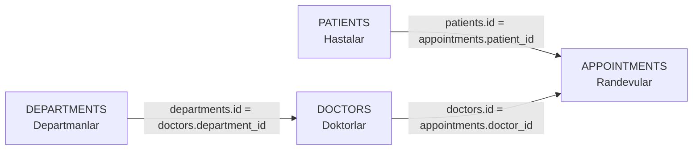

# Veritabanı İlişki Türleri

## Bire Bir İlişki – 1:1

Bir Kaydın Sadece Bir Karşılığı Vardır.

### Örnek

-  Bir Kullanıcı
-  O Kullanıcıya Ait Bir Profil

Kullanıcının E-Posta ve Şifre Bilgileri `users` Tablosunda; Biyografi, Doğum Tarihi, Kan Grubu ve TC Kimlik Numarası Gibi Bilgiler `user_profiles` Tablosunda Tutulabilir.

Bu Yapı:

-  Hassas Bilgileri Ana Tablodan Ayırır.
-  Tabloları Daha Düzenli Hale Getirir.

---

## Bire Çok İlişki – 1:N

Bir Kaydın Birden Fazla Karşılığı Olabilir; Ancak Diğer Taraftaki Her Kayıt Genellikle Tek Bir Ana Kayda Bağlıdır.

### Örnek

-  Bir Departmanda Birçok Çalışan Olabilir.
-  Bir Kategoride Birçok Ürün Olabilir.
-  Bir Öğretmenin Birçok Öğrencisi Olabilir.

Bu Yapıda Bir Olan Tablonun `PRIMARY KEY` Alanı, Çok Olan Tabloya `FOREIGN KEY` Olarak Eklenir.

Örneğin `departments.id`, `employees.department_id` Alanında Tutulabilir.

---

## Çoka Çok İlişki – N:M

Her İki Tarafta da Birden Fazla Kayıt Birbiriyle İlişkiliyse Çoka Çok İlişki Kullanılır.

### Örnek

-  Bir Öğrenci Birden Fazla Ders Alabilir.
-  Bir Ders Birden Fazla Öğrenci Tarafından Alınabilir.
-  Bir Ürün Birden Fazla Kategoriye Ait Olabilir.

İki Tablo Doğrudan Birbirine Bağlanmaz. Araya Bir **Pivot Tablo** veya **Köprü Tablo** Konur.

Örneğin:

```text
students
courses
enrollments
```

Köprü Tablo Genellikle Sadece İlişkiyi Kuracak ID Değerlerini Tutar. Öğrencinin Adı veya Dersin Saati Gibi Bilgiler Tekrar Buraya Yazılmaz; Bu Bilgiler İlgili Tablolardan Sorguyla Getirilir.

# SQLite

## Temel Veri Tipleri

-  `INTEGER`
-  `TEXT`
-  `DATETIME`

## Temel Kısıtlamalar

-  `PRIMARY KEY`: Her Satırı Benzersiz Olarak Tanımlar.
-  `FOREIGN KEY`: Bir Tablodaki Alanı Başka Bir Tablonun Anahtarına Bağlar.
-  `AUTOINCREMENT`: Sayısal ID Değerlerinin Otomatik Artmasını Sağlar.
-  `NOT NULL`: Alanın Boş Bırakılamayacağını Belirtir.
-  `UNIQUE`: Aynı Değerin İkinci Kez Kullanılmasını Engeller.
-  `DEFAULT`: Değer Girilmezse Otomatik Kullanılacak Değeri Belirler.
-  `CHECK`: Girilen Verinin Belirli Bir Şarta Uymasını Zorunlu Kılar.

Örneğin Bir Dersin Kredisi Sıfır Olamazsa:

```sql
credit INTEGER NOT NULL CHECK (credit > 0)
```

Bir Sınav Notunun 0 ile 100 Arasında Olması İstenirse:

```sql
final_grade INTEGER CHECK (final_grade BETWEEN 0 AND 100)
```
---

# Öğrenci – Kurs Veritabanı

## Veritabanı İlişkilerini Aktifleştirme

SQLite’ta Foreign Key Kurallarının Çalışması için:

```sql
PRAGMA foreign_keys = ON;
```

Bu Komut Yazılmazsa Foreign Key Silme ve Güncelleme Kuralları Beklendiği Gibi Çalışmayabilir.

## Öğrenciler Tablosu

```sql
CREATE TABLE IF NOT EXISTS students (
    id INTEGER PRIMARY KEY AUTOINCREMENT,
    student_number TEXT UNIQUE NOT NULL,
    full_name TEXT NOT NULL,
    created_at DATETIME DEFAULT CURRENT_TIMESTAMP
);
```

### Açıklama

-  `id`: Öğrencinin Veritabanı ID’sidir.
-  `student_number`: Öğrenci Numarasıdır ve Benzersiz Olmalıdır.
-  `full_name`: Öğrencinin Ad Soyad Bilgisidir.
-  `created_at`: Kaydın Oluşturulma Zamanını Otomatik Tutar.
-  Öğrenci Numarasını `INTEGER` Yerine `TEXT` Tutmak Daha Esnektir. Çünkü Başında Sıfır Bulunabilir veya İleride Harf İçerebilir.

---

## Kurslar Tablosu

```sql
CREATE TABLE IF NOT EXISTS courses (
    id INTEGER PRIMARY KEY AUTOINCREMENT,
    course_code TEXT UNIQUE NOT NULL,
    title TEXT NOT NULL,
    credit INTEGER NOT NULL CHECK (credit > 0)
);
```

### Açıklama

-  `course_code`: Dersin Benzersiz Kodudur.
-  `title`: Dersin Adıdır.
-  `credit`: Dersin Kredi Bilgisidir.
-  `CHECK (credit > 0)`, Kredinin Sıfır veya Negatif Girilmesini Engeller.

---

## Kayıtlar Tablosu

```sql
CREATE TABLE IF NOT EXISTS enrollments (
    student_id INTEGER NOT NULL,
    course_id INTEGER NOT NULL,
    enrollment_date DATETIME DEFAULT CURRENT_TIMESTAMP,
    final_grade INTEGER CHECK (final_grade BETWEEN 0 AND 100),

    PRIMARY KEY (student_id, course_id),

    FOREIGN KEY (student_id)
        REFERENCES students(id)
        ON DELETE CASCADE,

    FOREIGN KEY (course_id)
        REFERENCES courses(id)
        ON DELETE RESTRICT
);
```

```text
students
    │
    │ student_id
    ▼
enrollments
    ▲
    │ course_id
    │
courses
```

### Açıklama

-  `student_id`, Öğrenciler Tablosundaki `id` Alanına Bağlanır.
-  `course_id`, Kurslar Tablosundaki `id` Alanına Bağlanır.
-  `PRIMARY KEY (student_id, course_id)`, Aynı Öğrencinin Aynı Derse İki Kez Kaydolmasını Engeller.
-  Bu Yapı Bir **Birleşik Anahtar** Örneğidir.
-  `final_grade`, 0 ile 100 Arasında Olmalıdır.
-  `enrollment_date`, Öğrencinin Derse Kayıt Tarihini Tutar.
-  **Birinci FOREIGN KEY**
    - Bu Bölüm, ⁠enrollments.student_id Alanını ⁠students.id Alanına Bağlar.
    - Öğrenci Silindiğinde, O Öğrenciye Ait Kayıtları da Otomatik Olarak Siler.
    - Örneğin:

    ```text
    students
    id   full_name
    1    Abdullah Belli
    ```
    
    ```text
    enrollments
    student_id   course_id
    1            1
    ```
    
    ```sql
    DELETE FROM students
    WHERE id = 1;
    ```

    Bu Komut Çalıştığında:
    
    1. `students` Tablosundaki ID’si `1` Olan Öğrenci Silinir.
    2. `enrollments` Tablosunda `student_id = 1` Olan Kayıtlar da Silinir.
    3. Kursun Kendisi Silinmez.

- **İkinci FOREIGN KEY**
    - Bu Bölüm, ⁠enrollments.course_id Alanını ⁠courses.id Alanına Bağlar.
    - Bir Kursa Ait Öğrenci Kaydı Varsa, Kursun Silinmesini Engeller.
    - Örneğin:

    ```text
    courses
    id   title
    1    Flutter Dersi
    ```
    
    ```text
    enrollments
    student_id   course_id
    1            1
    ```
    
    ```sql
    DELETE FROM courses
    WHERE id = 1;
    ```
    
    Veritabanı Kursu Silemez. Çünkü Bu Kursa Bağlı Bir Öğrenci Kaydı Vardır.
    
    Önce İlişki Kaydı Silinmelidir:
    
    ```sql
    DELETE FROM enrollments
    WHERE student_id = 1
      AND course_id = 1;
    ```
    
    Daha Sonra Kurs Silinebilir:
    
    ```sql
    DELETE FROM courses
    WHERE id = 1;
    ```

---

# `ON DELETE` Kuralları

## `CASCADE`

Ana Kayıt Silindiğinde Ona Bağlı Alt Kayıtlar da Otomatik Olarak Silinir.

```sql
FOREIGN KEY (student_id)
REFERENCES students(id)
ON DELETE CASCADE
```

Örneğin Bir Öğrenci Silindiğinde, `enrollments` Tablosundaki O Öğrenciye Ait Tüm Kayıtlar da Silinir.

Ancak Öğrencinin Aldığı Kurslar Silinmez; Sadece Öğrenci ile Kurs Arasındaki Kayıtlar Silinir.

---

## `RESTRICT`

Ana Kaydın Altında Bağlı Kayıt Varsa Ana Kaydın Silinmesini Engeller ve Hata Verir.

```sql
FOREIGN KEY (course_id)
REFERENCES courses(id)
ON DELETE RESTRICT
```

Örneğin Bir Kursa Kayıtlı Öğrenci Varsa Kurs Silinemez.

Önce Kursa Ait Öğrenci Kayıtlarının Silinmesi Gerekir.

---

## `SET NULL`

Ana Kayıt Silindiğinde Alt Kaydın Foreign Key Alanı `NULL` Yapılır. Alt Kayıt Tamamen Silinmez.

Örneğin Bir Çalışanın Yöneticisi Silindiğinde, Çalışanın `manager_id` Alanı `NULL` Olabilir.

---

## `SET DEFAULT`

Ana Kayıt Silindiğinde Alt Kaydın Foreign Key Alanı Önceden Belirlenmiş Varsayılan Değere Çevrilir.

### Örnek

Bir Kategori Silindiğinde Ürünlerin `category_id` Değeri Genel Kategori Olan `1` Değerine Çevrilebilir.

---

### Veri Ekleme

```sql
INSERT INTO students (student_number, full_name)
VALUES
    ('ORG001', 'Abdullah Belli'),
    ('ORG002', 'Alaaddin Odabaşı');
```

```sql
INSERT INTO courses (course_code, title, credit)
VALUES ('MOB101', 'Flutter Dersi', 4);
```

```sql
INSERT INTO enrollments (student_id, course_id, final_grade)
VALUES (1, 1, 85);
```

---

# Referans Bütünlüğü

Referans Bütünlüğü, Tablolar Arasındaki Bağlantıların Tutarlı Kalmasını Sağlar.

Amaç:

-  Olmayan Bir Öğrenciye Kayıt Eklenmesini Engellemek.
-  Bağlı Kayıtlar Varken Ana Kaydın Yanlışlıkla Silinmesini Önlemek.
-  Silme ve Güncelleme İşlemlerinin Kontrollü Yapılmasını Sağlamak.

---

# Normalizasyon

Normalizasyon, Veritabanını Daha Düzenli Hale Getirmek ve Veri Tekrarını Azaltmak için Kullanılır.

Normalizasyonun Önlediği Üç Büyük Anomali:

## Ekleme Anomalisi

Yeni Bir Kayıt Eklemek İstenir; Ancak Gereksiz Başka Bir Bilgi Zorunlu Olduğu için Kayıt Eklenemez.

### Örnek

Henüz Hiç Öğrencisi Olmayan Bir Departman Eklenmek İsteniyor. Ancak Tablo Öğrenci Bilgisini Zorunlu Tutuyorsa Departman Eklenemez.

## Güncelleme Anomalisi

Aynı Bilgi Birçok Satırda Tekrar Ediyorsa Güncelleme Sırasında Bazı Satırlar Değişip Bazıları Değişmeyebilir.

### Örnek

Bir Departmanın Adı 10.000 Satırda Tekrar Ediyorsa, Bir Satır Güncellenmezse Veritabanında Tutarsızlık Oluşur.

## Silme Anomalisi

Bir Kayıt Silindiğinde, Aslında Silinmemesi Gereken Başka Bir Bilgi de Kaybolur.

### Örnek

Bir Departmanda Sadece Bir Muhasebeci Varsa ve Bu Çalışan Silindiğinde Departman Bilgisi de Kaybolabilir.

---

# Normalizasyon Kuralları

## 1NF

Her Hücre **Tekil ve Bölünemez** Olmalıdır.

Yanlış Örnek:

```text
telefonlar: 0532..., 0542...
ilaçlar: aspirin, arveles
```

Doğru Yaklaşım:

-  Her Telefon Ayrı Bir Satırda Tutulmalıdır.
-  Her İlaç Ayrı Bir Kayda Dönüştürülmelidir.
-  Aynı Hücrede Virgülle Ayrılmış Birden Fazla Veri Tutulmamalıdır.

Kısaca:

> Bir Hücrede Bir Tane Atomik Değer Bulunmalıdır.

---

# 2NF

Tablo 1NF Kurallarına Uymalıdır.

## Olmaması Gereken

```text
appointments
+------------+-----------+-------------+-------------+
| patient_id | doctor_id | patient_name | doctor_name |
+------------+-----------+-------------+-------------+
|     1      |    10     |    Ahmet     |    Mehmet    |
|     1      |    11     |    Ahmet     |    Ayşe      |
+------------+-----------+-------------+-------------+
```

Bu Tablonun Primary Key’i Şudur:

```sql
PRIMARY KEY (patient_id, doctor_id)
```
---

## Olması Gereken

Hasta, Doktor ve Randevu Bilgilerini Ayrı Tablolara Ayırırız.

### `patients`

```text
patients
+----+-------------+
| id | full_name   |
+----+-------------+
|  1 | Ahmet       |
+----+-------------+
```

### `doctors`

```text
doctors
+----+-------------+
| id | full_name   |
+----+-------------+
| 10 | Mehmet      |
| 11 | Ayşe        |
+----+-------------+
```

### `appointments`

```text
appointments
+------------+-----------+
| patient_id | doctor_id |
+------------+-----------+
|     1      |    10     |
|     1      |    11     |
+------------+-----------+
```

-   Hasta ID’si `1`, Doktor ID’si `10` ile Randevu Yapmış.
-   Hasta ID’si `1`, Doktor ID’si `11` ile de Randevu Yapmış.

Hasta Adı `patients` Tablosundan, Doktor Adı da `doctors` Tablosundan Alınır.

---

## Verileri Birlikte Getirmek

Hasta ve Doktor Adlarını Randevularla Birlikte Görmek için `INNER JOIN` Kullanabiliriz:

```sql
SELECT
    p.full_name AS patient_name,
    d.full_name AS doctor_name
FROM appointments a
INNER JOIN patients p
    ON a.patient_id = p.id
INNER JOIN doctors d
    ON a.doctor_id = d.id;
```

```text
patient_name   doctor_name
Ahmet          Mehmet
Ahmet          Ayşe
```

Burada İsimler `appointments` Tablosunda Tutulmaz; Sorgu Sırasında Diğer Tablolardan Getirilir.

---

# 3NF 

Tablo 2NF Kurallarına Uymalıdır.

## Olmaması Gereken

```text
Hasta No
Hasta Adı
Birden Fazla Telefon
Doktor No ve Doktor Adı
Departman Kodu ve Departman Adı
Birden Fazla İlaç
```

Bu Yapı:

-  Veri Tekrarına
-  Güncelleme Anomalilerine
-  Bir Hücrede Birden Fazla Veri Bulunmasına
-  Gereksiz Bağımlılıklara

Neden Olur.

## Olması Gereken

-  `patients`
-  `departments`
-  `doctors`
-  `appointments`



```sql
CREATE TABLE patients (
    id INTEGER PRIMARY KEY AUTOINCREMENT,
    tc_no TEXT UNIQUE NOT NULL,
    full_name TEXT NOT NULL,
    phone TEXT NOT NULL
);
```

```sql
CREATE TABLE departments (
    id INTEGER PRIMARY KEY AUTOINCREMENT,
    name TEXT NOT NULL
);
```

```sql
CREATE TABLE doctors (
    id INTEGER PRIMARY KEY AUTOINCREMENT,
    department_id INTEGER NOT NULL,
    full_name TEXT NOT NULL,

    FOREIGN KEY (department_id)
        REFERENCES departments(id)
);
```

```sql
CREATE TABLE appointments (
    id INTEGER PRIMARY KEY AUTOINCREMENT,
    patient_id INTEGER NOT NULL,
    doctor_id INTEGER NOT NULL,
    appointment_date DATETIME NOT NULL,

    FOREIGN KEY (patient_id)
        REFERENCES patients(id),

    FOREIGN KEY (doctor_id)
        REFERENCES doctors(id)
);
```
Burada:

-  Hasta Bilgileri Hastalar Tablosunda,
-  Departman Bilgileri Departmanlar Tablosunda,
-  Doktor Bilgileri Doktorlar Tablosunda,
-  Hasta ve Doktor İlişkisi Randevular Tablosunda

Tutulur.

Randevular Tablosuna `department_id` Eklenmez. Çünkü Doktorun Departmanı Zaten `doctors.department_id` Alanından Öğrenilebilir. Bu, 3NF Kuralına Uygundur.

---

## BCNF

BCNF, 3NF’in Daha Katı Bir Versiyonudur. Her Belirleyici Alanın, Bir Aday Anahtara Bağlı Olması Gerekir.

### Belirleyici Alan

Örneğin: doctor_id → department_id


Bu İfade Şunu Anlatır: Doktorun ID’sini Bildiğimizde, Bağlı Olduğu Departmanı da Bilebiliriz. Çünkü Bir Doktorun Hangi Departmanda Çalıştığı Bilgisi ⁠doctors Tablosunda Tutulur.

### Aday Anahtar
Bir Satırı Benzersiz Olarak Belirleyebilecek Her Alana veya Alan Grubuna Aday Anahtar Denir. Örneğin ⁠appointments Tablosunda: appointment_id


Tek Başına Bir Randevuyu Benzersiz Olarak Belirliyorsa Aday Anahtar Olabilir.

Aşağıdaki Birleşim de Randevuyu Benzersiz Belirleyebilir:

(patient_id, doctor_id, appointment_date)


Ancak Sadece: doctor_id


Genellikle Bir Randevuyu Benzersiz Belirleyemez. Çünkü Aynı Doktorun Birçok Hastası ve Birçok Randevusu Olabilir.

Özellikle Bankacılık, Hastane, Kripto Para Borsası ve Mahkeme Sistemleri Gibi Veri Kaybının Kesinlikle İstenmediği Büyük Projelerde Önemlidir.

---

# JOIN Mantığı

## INNER JOIN

İki Tabloda da Eşleşen Kayıtları Getirir.

Örneğin Kullanıcı ID’si Siparişler Tablosunda da Bulunuyorsa Kullanıcı ve Sipariş Bilgilerini Birleştirir.

## LEFT JOIN

Soldaki Tablodaki Tüm Kayıtları Korur. Sağdaki Tabloda Eşleşme Yoksa Sağ Taraf `NULL` Gelir.

## Self-Join

Self-Join, Bir Tablonun Kendi Kendisiyle Birleştirilmesidir.

En Yaygın Kullanım Alanları:

-  Çalışan ve Yönetici İlişkisi
-  Kategori ve Alt Kategori İlişkisi
-  Ürün ve Üst Ürün İlişkisi
-  Ağaç Yapıları
-  Organizasyon Şemaları

## Çalışanlar Tablosu

| ID | Name | Manager ID |
|---|---|---|
| 1 | Selahaddin Çiftçi | `NULL` |
| 2 | Ahmet Yılmaz | 1 |
| 3 | Mehmet Yılan | 2 |
| 4 | Jale Kaya | 2 |

-  `manager_id` Değeri `NULL` Olan Kişi Genel Müdür veya En Üst Yönetici Olabilir.
-  `manager_id = 1` Olan Çalışan, ID’si 1 Olan Selahaddin Çiftçi’ye Bağlıdır.
-  `manager_id = 2` Olan Çalışanlar, Ahmet Yılmaz’a Bağlıdır.

## Self-Join Sorgusu

```sql
SELECT
    e.name AS calisan_adi,
    IFNULL(m.name, 'Yöneticisi Yok (CEO)') AS yonetici_adi
FROM employees e
LEFT JOIN employees m
    ON e.manager_id = m.id;
```

| Çalışan Adı | Yönetici Adı |
|---|---|
| Selahaddin Çiftçi | Yöneticisi Yok (CEO) |
| Ahmet Yılmaz | Selahaddin Çiftçi |
| Mehmet Yılan | Ahmet Yılmaz |
| Jale Kaya | Ahmet Yılmaz |

### Açıklama

-  `e`, Çalışanlar Tablosunun İlk Kullanımına Verilen Takma İsimdir.
-  `m`, Aynı Tabloya İkinci Kez Verilen Takma İsimdir.
-  `LEFT JOIN`, Yöneticisi Olmayan Genel Müdürün de Sonuçlarda Görünmesini Sağlar.
-  `IFNULL`, Yönetici Bilgisi `NULL` İse Ekrana Açıklayıcı Bir Metin Yazdırır.
-  Sonuçta Her Çalışanın Yanında Yöneticisinin Adı Görünür.

---

# JSON ve BSON

## JSON

-  Metin Tabanlıdır.
-  İnsanlar Tarafından Okunabilir.
-  JavaScript Object Notation Anlamına Gelir.
-  REST API’lerde, Konfigürasyon Dosyalarında ve Veri Aktarımında Yaygın Kullanılır.
-  `String`, `Number`, `Boolean`, `Array` ve `Object` Gibi Veri Türlerini Destekler.

## BSON

-  Binary JSON Anlamına Gelir.
-  Verileri İkili Formatla Saklar.
-  İnsanlar Tarafından Doğrudan Okunması Zordur.
-  Makine Tarafından Daha Kolay ve Verimli İşlenebilir.
-  MongoDB’de Kullanılır.
-  JSON’a Göre Daha Fazla Veri Tipini Destekleyebilir.
-  Büyük Veri İşlemlerinde ve Dahili Veri Saklamada Tercih Edilebilir.

Kısaca:

> JSON İnsanların Daha Kolay Okuduğu Metin Tabanlı Bir Yapıdır. BSON Makinenin Daha Verimli İşleyebileceği Binary Bir Yapıdır.

---

# HTML Neden Öğreniliyor?

Flutter Geliştiricisi Sadece Mobil Uygulama Yazmaz. Uygulamaların İçinde veya Çevresinde Web Tabanlı Bölümlerle Karşılaşabilir.

HTML Şu Alanlarda Kullanılır:

1. **Bankacılık Uygulamaları**
   - Sözleşme Ekranları
   - KVKK Metinleri
   - 3D Secure Ekranları
   - Dışarıdan Gelen Web İçerikleri

2. **E-Ticaret ve Haber Uygulamaları**
   - WordPress’ten Gelen İçerikler
   - Strapi Gibi Yönetim Sistemlerinden Gelen Ürün ve Haber İçerikleri

3. **Web Görünümleri**
   - Uygulamanın İçinde Açılan Tarayıcı Ekranları
   - E-Posta Bültenleri
   - Hybrid Uygulama Bölümleri

4. **Mobil Uygulamayı Webde Çalıştırma**
   - Flutter Web
   - Ionic
   - Capacitor
   - Cordova

Web Tarayıcılarının Temel Olarak Okuduğu Yapı HTML’dir. Bu nedenle Mobil Geliştiricinin HTML, CSS ve JavaScript Bilmesi Gerekir.

---

# HTML5 Temel Yapısı

HTML Dosyasını Hızlı Oluşturmak için:

1. VS Code’da `!` Yazılır.
2. `Tab` Tuşuna Basılır.
3. HTML5 Başlangıç Şablonu Otomatik Oluşur.

```html
<!doctype html>
<html lang="en">
  <head>
    <meta charset="UTF-8" />
    <meta name="viewport" content="width=device-width, initial-scale=1.0" />
    <title>Document</title>
  </head>
  <body>
    <!-- Sayfada Görünecek İçerikler -->
  </body>
</html>
```

## `<!doctype html>`

Tarayıcıya Dosyanın HTML5 Standardında Olduğunu Bildirir.

## `<html>`

Tüm HTML Sayfasını Kapsar.

## `<head>`

Kullanıcıya Doğrudan Görünmeyen, Sayfanın Teknik Bilgilerinin Bulunduğu Bölümdür.

İçinde Genellikle:

-  Karakter Seti
-  Mobil Ekran Ayarı
-  Sayfa Başlığı
-  CSS Bağlantıları
-  İkonlar
-  SEO Bilgileri

Bulunur.

## `<meta charset="UTF-8">`

Türkçe Karakterlerin Doğru Görünmesini Sağlar.

## `<meta name="viewport">`

Mobil Geliştiriciler için Çok Önemlidir.

```html
<meta name="viewport" content="width=device-width, initial-scale=1.0" />
```

-  `width=device-width`: Sayfa Genişliğini Cihazın Ekran Genişliğine Uyarlar.
-  `initial-scale=1.0`: Sayfanın Başlangıç Yakınlaştırma Oranını Belirler.
-  Bu Satır Olmazsa Sayfa Mobil Cihazlarda Taşabilir veya Yanlış Ölçeklenebilir.

## `<title>`

Tarayıcı Sekmesinde Görünen Başlığı Belirler.

## `<body>`

Tarayıcıda Kullanıcının Gördüğü İçerikler Burada Bulunur.

---

# Örnek HTML

```html
<!doctype html>
<html lang="en">
  <head>
    <meta charset="UTF-8" />
    <!-- Bu Bölüm Mobil Geliştiriciler için Çok Ama Çok Önemli Satır.-->
    <meta name="viewport" content="width=device-width, initial-scale=1.0" />
    <title>Document</title>
  </head>
  <body>
    <header>
      <h1>Kodvance - Mobil Teknoloji Bülteni</h1>
      <p>Geleceğin Yazılım Teknolojileri Hakkında Güncel Bilgiler</p>
      <nav aria-label="Ana Menü">
        <ul>
          <li><a href="#Haberler">Son Haberler</a></li>
          <li><a href="#Kurslar">Son Kurslar</a></li>
          <li><a href="#İletişim">İletişim</a></li>
        </ul>
      </nav>
    </header>

    <main>
      <article id="Haberler">
        <header>
          <h2>Flutter 4.0 ve Mobil Devrimi</h2>
          <time datetime="2026-09-17">17 Eylül 2026</time>
          <p>Yazar: <strong>Mustafa ERSOY</strong></p>
        </header>
        <section>
          <h3>WASM ile 120 FPS Web Deneyimi</h3>
          <p>
            Google, Flutter 4.0 sürümünü duyurdu. Bu sürüm, mobil uygulama
            geliştirme sürecinde önemli yenilikler ve performans iyileştirmeleri
            sunuyor. Özellikle WebAssembly (wasm) desteği ile web tabanlı
            uygulamalarda 120 fps deneyimi sağlanabiliyor. Bu sayede
            kullanıcılar daha akıcı ve hızlı bir deneyim yaşayacak.
          </p>
          <figure>
            
            <figcaption>Flutter 4.0 ile Mobil Uygulama Geliştirme</figcaption>
          </figure>
        </section>
        <section>
          <h3>Mühendislik Yorumları</h3>
          <blockquote>
            <p>Blockquate Test</p>
          </blockquote>
        </section>
      </article>

      <section id="Kurslar">
        <h2>Haftalık Canlı Eğitim Programı</h2>
        <table width="100%">
          <thead>
            <tr>
              <td>Gün</td>
              <td>Modül</td>
              <td>Saat</td>
              <td>Eğitmen</td>
            </tr>
          </thead>
          <tbody>
            <tr>
              <td>Perşembe</td>
              <td>Veritabanı İlişkileri</td>
              <td>09:00 17:00</td>
              <td>Selahaddin ÇİFTÇİ</td>
            </tr>
            <tr>
              <td>Cuma</td>
              <td>Semantik Web ve Form Mimarisi</td>
              <td>09:00 17:00</td>
              <td>Selahaddin ÇİFTÇİ</td>
            </tr>
          </tbody>
        </table>
      </section>

      <aside>
        <h3>Önerilen Kaynaklar</h3>
        <ul>
          <li>
            <a href="https://flutter.dev/" target="_blank"
              >Flutter Resmi Sitesi</a
            >
          </li>
          <li>
            <a href="https://dart.dev/" target="_blank"
              >Dart Programlama Dili</a
            >
          </li>
          <li>
            <a href="https://webassembly.org/" target="_blank"
              >WebAssembly Hakkında</a
            >
          </li>
        </ul>
      </aside>
    </main>
    <footer id="İletişim">
      <p>&copy; 2026 Kodvance. Tüm Hakları Saklıdır.</p>
      <address>
        İletişim: <a href="mailto:info@kodvance.com">info@kodvance.com</a>
      </address>
    </footer>
  </body>
</html>
```


## Header

```html
<header>
  <h1>Kodvance - Mobil Teknoloji Bülteni</h1>
  <p>Geleceğin Yazılım Teknolojileri Hakkında Güncel Bilgiler</p>
```

## Navigation

```html
<nav aria-label="Ana Menü">
  <ul>
    <li><a href="#Haberler">Son Haberler</a></li>
    <li><a href="#Kurslar">Son Kurslar</a></li>
    <li><a href="#İletişim">İletişim</a></li>
  </ul>
</nav>
```

-  `nav`, Navigasyon Menüsüdür.
-  `ul`, Sırasız Liste.
-  `li`, Liste Elemanıdır.
-  `a`, Bağlantı Etiketidir.
-  `href="#Haberler"`, ID’si `Haberler` Olan Bölüme Sayfa İçinde Gitmeyi Sağlar.
-  Dahili Bağlantılarda Başına `#` Konulmalıdır.
-  `aria-label`, Ekran Okuyuculara Menünün Ne Olduğunu Açıklar.

---

## Main, Article

```html
<main>
  <article id="Haberler">
```

-  `main`, Sayfanın Ana İçeriğini Gösterir.
-  Sayfada Genellikle Bir Tane Ana `main` Bölümü Bulunur.
-  `article`, Tek Başına Anlamlı Olan Haber, Blog Yazısı veya Makale İçin Kullanılır.
-  `id="Haberler"`, Menüdeki `#Haberler` Bağlantısının Bu Bölüme Gitmesini Sağlar.

## H1, H2, H3

```html
<h1>Kodvance - Mobil Teknoloji Bülteni</h1>
<h2>Flutter 4.0 ve Mobil Devrimi</h2>
<h3>WASM ile 120 FPS Web Deneyimi</h3>
```

Başlıklar Hiyerarşik Kullanılır:

-  `h1`: Sayfanın Ana Başlığıdır.
-  `h2`: Ana Bölüm Başlığıdır.
-  `h3`: Alt Bölüm Başlığıdır.

### SEO Kuralı

-  Her Sayfada Yalnızca Bir Tane `h1` Bulunması Önerilir.
-  Birden Fazla `h1` Kullanılması Sayfanın Ana Konusunu Belirsiz Hale Getirebilir.
-  Başlıklar Sadece Görünüş için Değil, Anlamlı Bir Hiyerarşi Kurmak için Kullanılmalıdır.

---

## `time` Etiketi

```html
<time datetime="2026-09-17">17 Eylül 2026</time>
```

-  Kullanıcıya Tarihi Gösterir.
-  `datetime` Özelliği Tarihin Makine Tarafından Anlaşılabilir Formatını Belirtir.
-  Arama Motorları ve Ekran Okuyucular için Faydalıdır.

## `strong` Etiketi

```html
<p>Yazar: <strong>Mustafa ERSOY</strong></p>
```

`strong`, İçeriğin Önemli Olduğunu Belirtir ve Genellikle Kalın Görünür.

---

## Section, Figure, Image

### `section`

```html
<section>
  <h3>WASM ile 120 FPS Web Deneyimi</h3>
  <p>...</p>
</section>
```

`section`, Sayfanın Tematik Bir Bölümünü Belirtir.

Örneğin:

-  Haber İçeriği
-  Yorumlar
-  Kurslar
-  İletişim Bilgileri

Ayrı `section` Etiketleri İçinde Tutulabilir.

### `figure`

```html
<figure>
  
  <figcaption>Flutter 4.0 ile Mobil Uygulama Geliştirme</figcaption>
</figure>
```

-  `figure`, Resim veya Görsel İçeriği Gruplar.
-  `img`, Resmi Gösterir.
-  `src`, Resmin Adresidir.
-  `alt`, Resim Yüklenemezse Gösterilecek Açıklamadır ve Ekran Okuyucular için Gereklidir.
-  `figcaption`, Resmin Açıklamasını Belirtir.
-  `loading="lazy"`, Resmi Sayfa Açılır Açılmaz Değil, Gerektiğinde Yükler.

#### SEO ve Erişilebilirlik Kuralı

Her Resimde `alt` Özelliği Bulunmalıdır.

Yanlış:

```html

```

Doğru:

```html

```

---

## Blockquote

```html
<blockquote>
  <p>Blockquote Test</p>
</blockquote>
```

`blockquote`, Başka Bir Kişinin Sözü, Alıntı veya Vurgulanmak İstenen Bir Metin için Kullanılır.

---

## HTML Tablo Yapısı

```html
<table width="100%">
  <thead>
    <tr>
      <td>Gün</td>
      <td>Modül</td>
      <td>Saat</td>
      <td>Eğitmen</td>
    </tr>
  </thead>

  <tbody>
    <tr>
      <td>Perşembe</td>
      <td>Veritabanı İlişkileri</td>
      <td>09:00 17:00</td>
      <td>Selahaddin ÇİFTÇİ</td>
    </tr>
  </tbody>
</table>
```

-  `table`: Tabloyu Başlatır.
-  `thead`: Tablo Başlık Bölümüdür.
-  `tbody`: Tablo Verilerinin Bulunduğu Bölümdür.
-  `tr`: Tablo Satırıdır.
-  `td`: Hücredir.
-  `colspan="4"`, Bir Hücrenin Dört Sütunu Kaplamasını Sağlar.

Tablo, Görsel Olarak Düzenli Görünmesi için `border` ve `width` Özellikleriyle Biçimlendirilebilir. Ancak Gerçek Projelerde Görsel Tasarım için CSS Kullanılması Daha Doğrudur.

---

## Aside ve Footer

### 22.1. Aside

```html
<aside>
  <h3>Önerilen Kaynaklar</h3>
  <ul>
    <li>
      <a href="https://flutter.dev/" target="_blank">
        Flutter Resmi Sitesi
      </a>
    </li>
  </ul>
</aside>
```

`aside`, Ana İçeriği Destekleyen Yan İçeriktir.

Örnekler:

-  Yan Panel
-  Reklam
-  Önerilen Kaynaklar
-  İlgili Bağlantılar
-  Yazar Bilgisi

### Dış Bağlantılarda `target="_blank"`

```html
<a href="https://flutter.dev/" target="_blank">
  Flutter Resmi Sitesi
</a>
```

Dış Web Sitelerine Giden Linklerde `target="_blank"` Kullanılması İstenmiştir. Böylece Bağlantı Yeni Bir Tarayıcı Sekmesinde Açılır.

-  Kendi Sitenizin İçindeki Bir Bölüme Giden Linklerde Gerekmez.
-  Dış Sitelere Giden Linklerde Kullanılmalıdır.
-  Ders İçeriğinde Güvenlik Nedeniyle Dış Linklerin Yeni Sekmede Açılması Özellikle Vurgulanmıştır.

### Footer

```html
<footer id="İletişim">
  <p>&copy; 2026 Kodvance. Tüm Hakları Saklıdır.</p>
  <address>
    İletişim:
    <a href="mailto:info@kodvance.com">info@kodvance.com</a>
  </address>
</footer>
```

`footer`, Sayfanın veya Bir Bölümün Alt Kısmıdır.

İçinde:

-  Telif Hakkı
-  KVKK Bilgileri
-  İletişim
-  Sosyal Medya Linkleri
-  Adres
-  E-Posta

Bulunabilir.

`address`, İletişim Bilgilerini Belirtmek için Kullanılır.

---

# Semantik HTML ve Spagetti Kod

## Spagetti Kod

Her Şeyi `div` İçine Yazmak, Kapanışları Karıştırmak ve Anlamsız Bir İç İçe Yapı Kurmaktır.

Örneğin:

```html
<div class="header">
  <div class="menu"></div>
  <div class="content">
    <div class="haber-kutusu"></div>
  </div>
  <div class="footer"></div>
</div>
```

Bu Kod Çalışabilir; Ancak:

-  Okunabilirliği Düşüktür.
-  SEO Açısından Zayıftır.
-  Ekran Okuyucular İçeriği Doğru Anlayamayabilir.
-  Kodun Bakımı Zorlaşır.
-  Hangi Bölümün Ne İşe Yaradığı Belirsizleşir.

## Semantik Yapı

Daha Anlamlı Etiketler Kullanılır:

```html
<header>
  <nav></nav>
</header>

<main>
  <article>
    <section></section>
    <section></section>
  </article>

  <aside></aside>
</main>

<footer></footer>
```

Temel Semantik Etiketler:

-  `header`: Giriş veya Üst Bölüm
-  `nav`: Navigasyon Menüsü
-  `main`: Ana İçerik
-  `article`: Bağımsız İçerik
-  `section`: Tematik Bölüm
-  `aside`: Yan İçerik
-  `footer`: Alt Bölüm

Bu Yapı Hem SEO’yu Hem Erişilebilirliği Hem de Kod Okunabilirliğini İyileştirir.

---

# Statik ve Dinamik İçerik

Gerçek Projelerde Menü Adı, Başlık, Resim, Resim Açıklaması veya İletişim Yazısı Gibi İçerikler Mümkün Olduğunca Veritabanından Getirilebilir.

Avantajları:

-  Kullanıcı veya Yönetici İçeriği Kod Değiştirmeden Güncelleyebilir.
-  Aynı Kod Farklı İçeriklerle Kullanılabilir.
-  Uygulama Dinamik Hale Gelir.
-  Web ve Mobil İçerik Yönetimi Kolaylaşır.
-  SEO Bilgileri de Veritabanından Yönetilebilir.

Örneğin `h1` Etiketi Sabit Yazılmak Yerine Veritabanından Getirilebilir. Aynı Şekilde Resmin `alt` Açıklaması da Veritabanından Alınabilir.