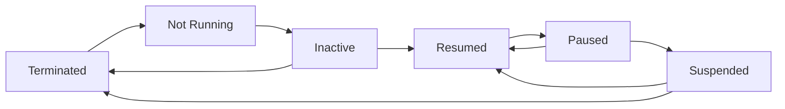
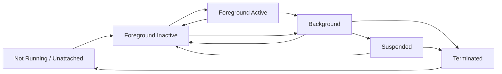

# 1 - 10

Bu Kursun Temel Amacı Yalnızca Flutter ile Ekran Tasarlamak Değil; **Performanslı, Güvenli, Sürdürülebilir ve Gerçek Hayatta Kullanılabilir Mobil Uygulamalar Geliştirebilen Bir Yazılımcı** Yetiştirmektir.

Mobil Uygulama Geliştirirken Üç Alan Birlikte Düşünülmelidir:

1. **Kullanıcı Arayüzü ve Mobil cihaz**
2. **Algoritma, Veri Yapıları ve Yazılım Mantığı**
3. **Ağ, API, Backend ve Sistem Mimarisi**

---

## 1. Kursun Genel Yapısı ve Beklentiler

Kurs Boyunca HTML, CSS, JavaScript, Dart, Algoritmalar, Veri Yapıları, API, Backend Mantığı, Ağ Temelleri, Git/GitHub ve Flutter İşlenecektir.

Öğrencilerden Beklenenler:

-  Derslere Düzenli Katılmak,
-  Soru Sormak ve Derse Aktif Katılmak,
-  Verilen Ödevleri Zamanında Teslim etmek,
-  Yazdığı Kodu Çalıştırıp Kontrol Etmek,
-  Kodunu Satır Satır Açıklayabilmek,
-  GitHub’da Düzenli Bir Çalışma Geçmişi Oluşturmak,
-  Grup Çalışmalarında Sorumluluk Almak,
-  Yapay Zekâyı Bilinçli ve Kontrollü Kullanmak.

Yüz yüze Eğitime Sınırlı Sayıda Öğrenci Seçilecektir. Seçimde Yalnızca Sınav Değil; **Devam Durumu, Ödev Kalitesi, GitHub Çalışmaları, Derse Katılım, Soru Sorma ve Uygulama Becerisi** de Dikkate Alınacaktır.

---

## 2. Mobil Uygulama Geliştirme Yaklaşımları

Mobil Uygulamalar Üç Ana Yöntemle Geliştirilebilir:

### Native Geliştirme

-  Android: Kotlin veya Java
-  iOS: Swift veya Objective-C

Avantajları:

-  Donanıma En Doğrudan Erişim,
-  Yüksek ve Tutarlı Performans,
-  Kamera, Bluetooth, Sensör ve Özel Donanımlarla İyi Uyum.

Dezavantajı, Android ve iOS için Genellikle Ayrı Kod Tabanları ve Ekipler Gerektirmesidir.

### Hybrid / WebView

Ionic, Cordova ve Capacitor Gibi Çözümler HTML, CSS ve JavaScript’i Uygulama İçindeki WebView ile Çalıştırır.

Avantajı, Web Geliştiricilerinin Mobil Uygulamaya Daha Kolay Geçebilmesidir. Ancak:

-  RAM ve Pil Tüketimi Artabilir,
-  Dokunma Tepkisi Gecikebilir,
-  Animasyonlar Takılabilir,
-  Yoğun Listelerde ve Grafiklerde Performans Düşebilir.

Mevcut Bir Web Uygulamasını Hızlıca Mobil Uygulamaya Taşımak veya Yalnızca Birkaç Web Sayfasını Uygulama İçinde Göstermek için Kullanılabilir. Fakat Tüm Uygulamayı WebView ile Yapmak Her Zaman Doğru Değildir.

### Cross-Platform

Flutter ve React Native ile Tek Kod Tabanından Android ve iOS Uygulamaları Üretilebilir.

Avantajları:

-  Daha Hızlı Geliştirme,
-  Daha Düşük Ekip ve Bakım Maliyeti,
-  Tek Kod Tabanında Hata Düzeltme,
-  İki Platforma Aynı Anda Uygulama Çıkarma.

Flutter’ın Önemli Özellikleri:

-  Google Tarafından Desteklenmesi,
-  Kendi Çizim Sistemi ve Bileşenlerine Sahip Olması,
-  Farklı Ekranlarda Daha Tutarlı Görünüm Sunması,
-  Büyük ve Gerçek Kullanıcıya Sahip Uygulamalarda da Kullanılabilmesi.

Native Uygulamalar Bazı Özel Durumlarda Daha Yüksek Performans Sunabilir. Ancak Bankacılık, E-Ticaret, Rezervasyon ve Standart İş Uygulamalarının Çoğunda Flutter veya React Native Yeterli Olabilir.

### Teknoloji Seçimi

Teknoloji Seçerken Şu Sorular Sorulmalıdır:

-  Projenin Performans İhtiyacı Nedir?
-  Kamera, Sensör veya Özel Donanıma Ne Kadar Erişilecek?
-  Ekip Kaç Kişiden Oluşuyor?
-  Teslim Süresi ve Bütçe Nedir?
-  Uygulama Ne Kadar Büyüyecek?
-  Bakım ve Test İhtiyacı Ne Olacak?
-  Android ve iOS Mağaza Kuralları Nelerdir?

---

## 3. Mobil Cihazların Kaynakları ve Performans

Telefonlar Bilgisayarlar Kadar Sınırsız Kaynağa Sahip Değildir. Mobil Uygulamalarda Özellikle Şu Kaynaklar Dikkatli Kullanılmalıdır:

-  Pil,
-  RAM,
-  CPU,
-  GPU,
-  Isı,
-  İnternet Trafiği,
-  Depolama Alanı.

### SoC

Mobil Cihazlarda CPU, GPU, Modem, Kamera İşlemcisi ve Yapay Zekâ İşlemcisi Gibi Birçok Bileşen Genellikle Tek Bir Çip Üzerinde Bulunur. Buna **SoC – System On A Chip** Denir.

### Big.LITTLE

İşlemcilerde Genellikle İki Tür Çekirdek Bulunur:

-  **Verimlilik Çekirdekleri:** Daha Az Enerji Tüketir; Basit ve Arka Plan İşlemleri için Uygundur.
-  **Performans Çekirdekleri:** Daha Hızlıdır; Fakat Daha Fazla Pil Tüketir ve Isı Üretir.

Gereksiz Bir İşlem Sürekli Performans Çekirdeğinde Çalışırsa:

1. Pil Hızlı Tükenir.
2. Telefon Isınır.
3. İşlemci Kendini Korumak için Hızını Azaltır.
4. Uygulama Yavaşlar ve Takılabilir.

Bu Duruma **Thermal Throttling** Denir.

### State (Temp: RAM) Data / Local (Temp: Disk) Data

Her İşlemde Sunucuya Tekrar Tekrar İstek Göndermek Yerine Bazı Veriler Cihazda Tutulabilir. Bu Sayede:

-  API Çağrılarını Azaltır,
-  Uygulamanın Daha Hızlı Tepki Vermesini Sağlar,
-  Sunucu ve Pil Yükünü Düşürür,
-  İnternet Zayıfken Uygulamanın Çalışmasına Yardımcı Olur.

---

## 4. Ekranlar, Ölçü Birimleri ve Sensörler

Farklı Cihazların Ekran Boyutları ve Piksel Yoğunlukları Aynı Değildir. Bu Nedenle Arayüz Yalnızca Sabit Piksel Değerleriyle Tasarlanmamalıdır.

-  **Pixel:** Ekrandaki Fiziksel Görüntü Noktasıdır. Örnek:
    -  Telefon A: 1080 × 2400 pixel, 6 inç
    -  Telefon B: 1080 × 2400 pixel, 6,7 inç
İkisinde de Aynı Sayıda Piksel Vardır; Fakat Telefon A’daki Pikseller Daha Yoğun Olur (DPI).
-  **DPI:** Piksel Yoğunluğudur.
-  **DP:** Android’de Yoğunluğa Uyumlu Ölçü Birimidir.
-  **Point:** iOS’ta Kullanılan Benzer Ölçü Birimidir.

Android’de yoğunluk ölçekleri genel olarak şöyledir:

-  MDPI: 1x
-  HDPI: 1,5x
-  XHDPI: 2x
-  XXHDPI: 3x
-  XXXHDPI: 4x

**Örnek**: Bir Buton: 100 DP

| Ekran Yoğunluğu | Ölçek | 100 DP'nin Fiziksel Karşılığı |
|---|---:|---:|
| MDPI | 1x | 100 px |
| HDPI | 1,5x | 150 px |
| XHDPI | 2x | 200 px |
| XXHDPI | 3x | 300 px |
| XXXHDPI | 4x | 400 px |

Amaç, Buton ve İkonların Farklı Cihazlarda Fiziksel Olarak Benzer Büyüklükte Görünmesidir. Geliştirici Responsive Tasarım Mantığını Bilmelidir.

### Temel Sensörler

-  **İvmeölçer:** Hareketi ve Yer Çekimi İvmesini Ölçer. Ekran Döndürme ve Adım Sayma Gibi İşlerde Kullanılır.
-  **Jiroskop:** Cihazın Dönme Hareketini ve Açısal Hızını Ölçer. Oyun, Kamera Sabitleme ve Eğim Algılama için Kullanılır.
-  **Biyometrik Sensörler:** Face ID, Optik Parmak İzi ve Ultrasonik Parmak İzi Okuyucuları Gibi Sistemlerdir.

İvmeölçer ve Jiroskop Çoğu Zaman Birlikte Kullanılır.

---

## 5. Mobil Uygulama Yaşam Döngüsü

Uygulama Her Zaman Aktif Durumda Değildir. İşletim Sistemi Uygulamayı Farklı Aşamalara Geçirir.

### Android



-  **Not Running:** Uygulama Çalışmıyor.
-  **Inactive:** Uygulama Başlatıldı, Fakat Geçici Olarak Kullanıcı Etkileşimini Kabul Etmiyor. Örnekler
      - Uygulama Açılış / Kapanış Ekranı
      - Uygulama Açık Olduğu Sırada Telefon Araması Gelmesi, Bildirim veya Başka Bir Sistem Penceresi Uygulamanın Üzerine Gelmesi, vb.
-  **Active / Resumed:** Uygulama Başlatıldı ve Kullanıcı Uygulamayı Aktif Olarak Kullanıyor.
-  **Paused:** Uygulama Arka Plana Geçti.
-  **Suspended:** Uygulama Donduruldu ve Aktif İşlem Yapmıyor.
-  **Terminated:** Uygulama Tamamen Kapatıldı veya İşletim Sistemi Tarafından Sonlandırıldı.

### iOS



Telefonun RAM’i Azaldığında İşletim Sistemi Arka Plandaki Uygulamaları Kapatabilir. Bu Nedenle Geliştirici, Uygulamanın Her Zaman Bellekte Kalacağını Varsaymamalıdır.

Örneğin Kullanıcı Bir Form Doldururken Uygulamadan Ayrılır ve uygulama Sonlandırılırsa Form Verileri Kaybolabilir. Önemli Geçici Veriler Yerel Olarak Saklanmalı ve Uygulama Yeniden Açıldığında Geri Yüklenebilmelidir.

iOS Arka Plan Çalışmasına Daha Katı Yaklaşır. Android Daha Esnektir; Ancak Üreticiye ve Cihaz Ayarlarına Göre Farklı Davranışlar Görülebilir:

 - **Telefon Üreticisi**: Samsung, Xiaomi, Huawei, Oppo vb. Üreticiler Kendi Pil Tasarrufu Sistemlerini Kullanabilir.
 - **Cihaz Ayarları**: Kullanıcı "Pil Tasarrufu", "Arka Plan Etkinliğini Kısıtla" veya "Uygulamayı Uykuya Al" Seçeneklerini Açmış Olabilir.
 - ...

Örneğin Bir Xiaomi Telefonda Pil Tasarrufu Ayarı Açıksa, Sistem Uygulamanın Arka Planda Çalışmasını Engelleyebilir. Fakat Aynı Uygulama Başka Bir Android Telefonda Normal Şekilde Çalışabilir.

Yani Geliştirici Şu Varsayımı Yapmamalıdır: "Android’de Uygulamam Arka Plana Geçse Bile Kesinlikle Çalışmaya Devam Eder."

Daha Doğru Yaklaşım Şudur: "Uygulamam Her An Durdurulabilir veya Sonlandırılabilir; Bu Nedenle Önemli Verileri Kaydetmeli ve Uygulama Yeniden Açıldığında Kaldığı Yerden Devam Edebilmelidir."

Gereksiz Arka Plan İşlemleri:

-  Pil Tüketimini,
-  RAM Kullanımını,
-  API Çağrılarını,
-  Sunucu Maliyetini Artırır.

---

## 6. Algoritmik Düşünme ve Veri Tipleri

İyi Yazılımcı Yalnızca Kod Yazmaz; Problemi Parçalara Ayırır ve Çözümü Önceden Planlar.

Bir Algoritmanın Temel Özellikleri:

-   Girdi Alması,
-   Çıktı Üretmesi,
-   Adımlarının Kesin Olması,
-   Sonlu Olması.

### Algoritma Hazırlama Sırası

1. Problemi Küçük Parçalara Ayır.
2. Girdileri ve Çıktıları Belirle.
3. Normal ve Hatalı Durumları Düşün.
4. Sözde Kod veya Akış Şeması (Mermaid) Oluştur.
5. Dry Run Yaparak Elle Test Et.
6. Daha Sonra Programlama Dilinde Kodla.

### Akış Şeması Şekilleri

-   **Oval:** Başlangıç ve Bitiş
-   **Dikdörtgen:** İşlem
-   **Elmas:** Karar
-   **Ok:** Akış Yönü

### Veri Tipleri

-   **Integer:** Tam Sayılar
-   **Float / Double / Decimal:** Ondalıklı Sayılar
-   **Char:** Tek Karakter
-   **String:** Metin
-   **Boolean:** Doğru/Yanlış Bilgisi

32 Bit Signed Integer Yaklaşık Olarak:

-   Minimum: `-2.147.483.648`
-   Maksimum: `2.147.483.647`

Aralığındadır.

Bu Sınır Aşılırsa **Integer Overflow** Oluşabilir. Binary Search’te:

```text
mid = (low + high) / 2
```

Yerine Daha Güvenli Olarak:

```text
mid = low + (high - low) / 2
```

Kullanılabilir.

Metinlerde Türkçe Karakterler ve Emojiler için ASCII Yerine Unicode ve Genellikle UTF-8 Kullanılmalıdır.

---

## 7. Diziler (Matrisler)

Dizilerin İlk Elemanı `0` İndeksindedir. Bunun Nedeni Bellek Adreslerinin Taban Adres ve Offset Mantığıyla Hesaplanmasıdır.

### Çok Boyutlu Diziler

Matrisler Satır ve Sütunlardan Oluşur:

```text
matris[satır][sütun]
```

-   Satırlar Yataydır.
-   Sütunlar Dikeydir.
-   `matris[1][3]`, 1. Satır ve 3. Sütun Anlamına Gelir.

Satranç Tahtası, Sudoku, Sinema Koltukları ve Ekran Pikselleri Matrisle Modellenebilir.

İç İçe Döngülerde Genellikle:

-   `i`: Satır
-   `j`: Sütun

Olarak Kullanılır.

Matrisi Dolaşırken Çoğu Durumda Önce Satır, Sonra O Satırın Sütunlarını Gezmek Daha Verimlidir. Çünkü Bellekte Yan Yana Bulunan Verilere Sıralı Erişim, Önbelleğin Daha İyi Kullanılmasını Sağlar.

## 8. Arama Algoritmaları

### Linear Search

Liste Baştan Sona Tek Tek Kontrol Edilir.

-   Veri Sıralı Olmak Zorunda Değildir.
-   Uygulaması Kolaydır.
-   Karmaşıklık: `O(n)`
-   Büyük Listelerde Yavaş Olabilir.

```python
def linear_search(liste, aranan):
    for i in range(len(liste)):
        if liste[i] == aranan:
            return i
    return -1

sayilar = [10, 4, 25, 7, 18]
aranan = 7

sonuc = linear_search(sayilar, aranan)

if sonuc != -1:
    print(f"Eleman {sonuc}. İndekste Bulundu.")
else:
    print("Eleman Bulunamadı.")
```

Çıktı:

```text
Eleman 3. İndekste Bulundu.
```

**Not**: Kod Test Edildi.

### Binary Search

Yalnızca Sıralı Veride Kullanılabilir.

1. Ortadaki Elemana Bakılır.
2. Aranan Değer Küçükse Sağ Taraf Elenir.
3. Büyükse Sol Taraf Elenir.
4. Kalan Bölüm Tekrar İkiye Bölünür.

Karmaşıklk:`O(log n)`’dir. Bir Milyar Kayıt için Yaklaşık 30 Karşılaştırma Yeterli Olabilir.

Ancak Veri Sıralı Değilse Binary Search Doğrudan Kullanılamaz. Önce Sıralama Yapılmalı veya Linear Search Tercih Edilmelidir. Sıralamanın da Bir Maliyeti Olduğu Unutulmamalıdır.

```python
def binary_search(liste, aranan):
    sol = 0
    sag = len(liste) - 1

    while sol <= sag:
        orta = (sol + sag) // 2
        
        if liste[orta] == aranan:
            return orta
        elif aranan < liste[orta]:
            sag = orta - 1
        else:
            sol = orta + 1
    
    return -1


sayilar = [3, 7, 12, 18, 25, 31, 40]
aranan = 25

sonuc = binary_search(sayilar, aranan)

if sonuc != -1:
    print(f"Eleman {sonuc}. İndekste Bulundu.")
else:
    print("Eleman Bulunamadı.")
```

Çıktı:

```text
Eleman 4. İndekste Bulundu.
```

**Not**: Kod Test Edildi.

---

## 9. Swap

İki Değeri Güvenli Biçimde Değiştirmek için Genellikle Geçici Değişken Kullanılır:

```text
temp = a
a = b
b = temp
```

Doğrudan:

```text
a = b
b = a
```

Yazılırsa İlk `a` Değeri Kaybolur.

```python
a = 10
b = 20

print("Swap Öncesi:")
print("a =", a)
print("b =", b)

temp = a
a = b
b = temp

print("Swap Sonrası:")
print("a =", a)
print("b =", b)
```

Çıktı:

```text
Swap Öncesi:
a = 10
b = 20
Swap Sonrası:
a = 20
b = 10
```

Python’da Swap İşlemi Daha Kısa Şekilde de Yapılabilir:

```python
a = 10
b = 20

a, b = b, a

print("a =", a)
print("b =", b)
```

Çıktı:

```text
a = 20
b = 10
```

## 10. Sıralama Algoritmaları

### Bubble Sort

Yan Yana Elemanlar Karşılaştırılır. Soldaki Büyükse Değerler Swap Edilir. Her Turda En Büyük Değer Dizinin Sonuna Taşınır.

Özellikleri:

-   Öğretici ve Basittir.
-   Küçük Dizilerde Kullanılabilir.
-   Büyük Veri Kümelerinde Yavaştır.
-   Ortalama ve Kötü Durumda Karmaşıklık: `O(n²)`

```python
def bubble_sort(liste):
    n = len(liste)

    for i in range(n):
        for j in range(0, n - i - 1):
            if liste[j] > liste[j + 1]:
                liste[j], liste[j + 1] = liste[j + 1], liste[j]

    return liste

sayilar = [5, 2, 8, 1, 3]

print("Sıralanmamış Liste:", sayilar)

sirali_liste = bubble_sort(sayilar)

print("Sıralanmış Liste:", sirali_liste)
```

Çıktı:

```text
Sıralanmamış Liste: [5, 2, 8, 1, 3]
Sıralanmış Liste: [1, 2, 3, 5, 8]
```

**Not**: Kod Test Edildi.

### Selection Sort

Her Turda Kalan Bölüm Taranır, En Küçük veya En Büyük Değer Bulunur ve Uygun Konuma Tek Bir Swap ile Yerleştirilir.

Bubble Sort’a Göre Daha Kontrollü Swap Yapar; Ancak Büyük Veri Kümeleri için Yine İdeal Değildir.

```python
def selection_sort(liste):
    n = len(liste)

    for i in range(n):
        en_kucuk_index = i

        for j in range(i + 1, n):
            if liste[j] < liste[en_kucuk_index]:
                en_kucuk_index = j

        liste[i], liste[en_kucuk_index] = (
            liste[en_kucuk_index],
            liste[i]
        )

    return liste


sayilar = [64, 25, 12, 22, 11]

print("Sıralanmamış Liste:", sayilar)

sirali_liste = selection_sort(sayilar)

print("Sıralanmış Liste:", sirali_liste)
```

Çıktı:

```text
Sıralanmamış Liste: [64, 25, 12, 22, 11]
Sıralanmış Liste: [11, 12, 22, 25, 64]
```

**Not**: Kod Test Edildi.

### Python’da Hazır Sıralama

```python
sayilar = [5, 2, 8, 1, 3]

sayilar.sort()

print(sayilar)
```

Çıktı:

```text
[1, 2, 3, 5, 8]
```

`sort()` Listeyi Doğrudan Değiştirir. `sorted()` İse Yeni Bir Sıralı Liste Oluşturur:

```python
sayilar = [5, 2, 8, 1, 3]

sirali_liste = sorted(sayilar)

print("Orijinal Liste:", sayilar)
print("Sıralı Liste:", sirali_liste)
```

Çıktı:

```text
Orijinal Liste: [5, 2, 8, 1, 3]
Sıralı Liste: [1, 2, 3, 5, 8]
```

---

## 11. Ağ, API ve Veri İletişimi

### Backend, API ve Frontend

-   **Backend:** İş Mantığı ve Veri İşlemleri.
-   **API:** Frontend ile Backend Arasındaki İletişim Kanalı.
-   **Frontend / Mobil Uygulama:** Kullanıcının Gördüğü ve Kullandığı Bölüm.

Backend’in Python, PHP, .NET veya Node.js ile Yazılması Tek Başına Önemli Değildir. Önemli Olan Veri Yapısının, API’nin ve Katmanların Doğru Tasarlanmasıdır.

Mobil Uygulama Çoğunlukla İstemci Görevi Görür:

1. Kullanıcı İşlem Yapar.
2. Uygulama Sunucuya İstek Gönderir.
3. Backend İsteği İşler.
4. Veritabanı veya Başka Servislerle İletişim Kurulur.
5. Sonuç JSON Olarak Uygulamaya Döner.
6. Uygulama Sonucu Ekranda Gösterir.

### Domain, DNS ve IP

Kullanıcı `example.com` Yazar; Cihaz İse IP Adresiyle İletişim Kurar. DNS, Domain Adını IP Adresine Çevirir.

-   **A:** IPv4 Adresi
-   **AAAA:** IPv6 Adresi
-   **CNAME:** Başka Bir Domain’e Takma Ad
-   **MX:** E-Posta Sunucusu

### TCP ve UDP

**TCP:**

-   Paket Sırasını ve Ulaşmasını Takip Eder.
-   Gerekirse Kayıp Paketleri Tekrar Gönderir.
-   API, Ödeme, Dosya ve Veritabanı İşlemlerinde Kullanılır.

**UDP:**

-   Daha Hızlı ve Düşük Gecikmelidir.
-   Paket Kaybını veya Sırasını Garanti Etmez.
-   Canlı Yayın, Oyun, Sesli ve Görüntülü Görüşmelerde Kullanılır.

Aynı Uygulamada İkisi Birlikte Kullanılabilir. Örneğin Kamera Açma Komutu TCP, Canlı Görüntü Akışı UDP Üzerinden Çalışabilir.

### HTTP ve HTTPS

-   **HTTP Port**: 80 (Plain Text)
-   **HTTPS Port**: 443
-   HTTPS, TLS ile İletişimi Şifreler ve Sunucunun Kimliğini Doğrulamaya Yardımcı Olur.

HTTPS Kullanmak Tek Başına Tüm Uygulamayı Güvenli Hâle Getirmez; Sadece İletişim Kanalını Korur.

### HTTP Metotları

-   **GET:** Veri Okuma
-   **POST:** Yeni Kayıt veya İşlem Oluşturma
-   **PUT:** Kaydı Tamamen Güncelleme
-   **PATCH:** Kaydın Bir Bölümünü Güncelleme
-   **DELETE:** Kayıt Silme

Her İşlemi POST ile Yapmak Mümkün Olsa da API’nin Anlamını ve Bakımını Zorlaştırır.

### HTTP Durum Kodları

-   `2xx`: Başarılı
-   `3xx`: Yönlendirme
-   `4xx`: İstemci veya İstek Kaynaklı Hata
-   `5xx`: Sunucu Kaynaklı Hata

Önemli Kodlar:

-   `200`: Başarılı
-   `201`: Yeni Kayıt Oluşturuldu
-   `204`: Başarılı, İçerik Yok
-   `400`: Hatalı İstek
-   `401`: Kimlik Doğrulama Yok Veya Geçersiz
-   `403`: Kimlik Biliniyor Fakat Yetki Yok
-   `404`: Kaynak Bulunamadı
-   `500`: Genel Sunucu Hatası
-   `503`: Servis Kullanılamıyor
-   `504`: Sunucu Tarafında Zaman Aşımı

`401` ile `403` Karıştırılmamalıdır:

> 401: “Sen Kimsin?”  
> 403: “Seni Tanıyorum Ama İzin Vermiyorum.”

### JSON

Farklı Programlama Dillerinin Ortak Veri Formatıdır. Mobil Uygulamada Nesne JSON’a Dönüştürülerek Gönderilir; Gelen JSON Tekrar Nesneye Dönüştürülür.

Veri Tipleri Uyumlu Olmalıdır. Örneğin Sayı Beklenen Yerde `\"10\"` Şeklinde String Gönderilirse Hata Oluşabilir.

JSON’un Kendisi Şifreleme Değildir. Güvenlik için HTTPS, TLS, Güvenli Token Yönetimi ve Doğru Kimlik Doğrulama Gerekir.

API İletişimini İncelemek İçin:

-   cURL,
-   Tarayıcı Network Paneli,
-   Request/Response Headers,
-   Payload,
-   Status Code

Kullanılabilir.

---

## 12. Hata Yönetimi, Offline Çalışma ve Yazılım Mimarisi

İyi Bir Uygulama Hata Oluştuğunda Kullanıcıyı Boş Ekranda Bırakmaz.

Örnekler:

-   `404`: Kaynak Bulunamadı; Kullanıcıya Alternatif Gösterilebilir.
-   `500`: Sunucu Problemi; Tekrar Deneme Seçeneği Sunulabilir.
-   Zayıf İnternet: Timeout Uygulanmalı ve Kullanıcı Bilgilendirilmelidir.

Uygulama Sonsuza Kadar Yükleniyor Ekranında Kalmamalıdır.

## Offline Çalışma

SQLite, Cache Data (State Data) ve Yerel Veri (Local Data) Saklama ile Uygulamanın Bazı Bölümleri İnternet Olmadan Çalışabilir (Instagram veya Facebook’da Bu Özellik Var).

Yerel Olarak Şunlar Tutulabilir:

-   Daha Önce Yüklenen Ürünler,
-   Son Görüntülenen İçerikler,
-   Ayarlar,
-   Yorumlar,
-   Geçici Form Verileri.

İnternet Geri Geldiğinde Yerel ve Sunucu Verileri Senkronize Edilmelidir.

### Monolitik ve Mikroservis Mimarisi

#### Monolitik Yapı

Tüm Modüller Tek Uygulama İçinde Bulunur.

Avantajları:

-   Başlangıçta Daha Kolaydır.
-   Küçük Ekip ve Projeler için Uygundur.
-   Dağıtımı Basittir.

Dezavantajları:

-   Bir Bölümdeki Hata Tüm Sistemi Etkileyebilir.
-   Büyüdükçe Yönetim Zorlaşır.
-   Her Bölümü Bağımsız Ölçeklendirmek Mümkün Olmayabilir.

#### Mikroservis Yapısı

Sistem Kullanıcı, Ödeme, Ürün, Kargo ve Bildirim Gibi Bağımsız Servislere Ayrılır.

Avantajları:

-   Servisler Bağımsız Güncellenebilir.
-   Bir Servisin Çökmesi Tüm Sistemi Durdurmayabilir.
-   Servisler Ayrı Ayrı Ölçeklendirilebilir.

Dezavantajları:

-   Kurulumu ve Yönetimi Zordur.
-   Servisler Arası İletişim Karmaşıklaşır.
-   İzleme ve Hata Ayıklama Daha Fazla Emek İster.

Küçük Projelerde Monolitik Yapı Yeterli Olabilir. Büyük, Yüksek Trafikli ve Birçok Bağımsız İş Alanına Sahip Sistemlerde Mikroservis Düşünülebilir.

## Kuyruklar ve Redis

Ani Yoğunlukta Tüm İstekleri Aynı Anda İşlemek Yerine İstekler Kuyruğa Alınabilir. Redis Gibi Sistemler:

-   İstekleri Sıraya Alabilir,
-   Geçici Verileri Hızlı Tutabilir,
-   Ani Yükü Azaltabilir.

Ancak İstek Sunucuya Hiç Ulaşmadıysa Redis Bunu Kurtaramaz. Bu Nedenle Tekrar Deneme, İşlem Kaydı ve Durum Kontrolü de Gerekir.

---

## 13. Ödeme Sistemlerinde Güvenilirlik

Ödeme İşlemleri En Kritik Konulardan Biridir.

Örnek Problem:

1. Kullanıcı Ödeme Yapar.
2. Banka Parayı Çeker.
3. E-Ticaret Sunucusu Bağlantı Kopması Nedeniyle Sonucu Alamaz.
4. Kullanıcının Parası Çekilir, Ancak Sipariş Oluşturulmaz.

Bu Sorunu Azaltmak için:

-   Her İşleme Benzersiz İşlem Numarası veya Token Verilmeli,
-   Ödeme Durumu Veritabanında Tutulmalı,
-   `Bekliyor`, `Başarılı`, `Başarısız` Gibi Durumlar Kullanılmalı,
-   Sistem Bekleyen İşlemleri Belirli Aralıklarla Tekrar Sorgulamalı,
-   Aynı İşlem İkinci Kez Sipariş veya Ödeme Oluşturmamalıdır.

Bu Son Özellik **Idempotency** olarak Adlandırılır.

Aynı İşlem Tekrar Kontrol Edildiğinde Sonuç Değişmemeli ve Çift Ödeme/Çift Sipariş Oluşmamalıdır.

---

## 14. Mağaza Kuralları ve Yayınlama

iOS Uygulamalarını App Store’a Göndermek için macOS ve Xcode Gerekir. Windows veya Linux ile Flutter Kodlanabilir ve Android Testleri Yapılabilir; Ancak iOS Derleme ve Yayınlama Aşamasında macOS Gereklidir.

Uygulama Mağazalarında:

-   Dijital Ürün ve Aboneliklerde Mağazanın Ödeme Sistemi Zorunlu Olabilir.
-   Harici Ödeme Kullanımı Reddedilmeye Neden Olabilir.
-   Apple’ın İnceleme Süreci Daha Katı Olabilir.
-   Test Hesapları ve Giriş Bilgileri İstenebilir.
-   İnceleme Ekibinin Uygulamanın Tüm Bölümlerine Erişebilmesi Gerekir.
-   Mağaza Politikaları Zamanla Değişebileceği için Güncel Kurallar Kontrol Edilmelidir.

---

## 15. Yapay Zekâ Kullanımı

Yapay Zekâ:

-  Tekrarlayan Kodları,
-  Formları,
-  Basit CRUD İşlemlerini,
-  Kod Şablonlarını,
-  Dokümantasyon Taslaklarını

Hazırlamak için Kullanılabilir.

Ancak Şu Konular Tamamen Yapay Zekâya Bırakılmamalıdır:

-  Güvenlik Kararları,
-  Karmaşık İş Mantığı,
-  Kritik Algoritmalar,
-  Ödeme İşlemleri,
-  Donanım Kontrolü,
-  Uygulama Mimarisi,
-  Veri Akışı.

Yapay Zekânın Yazdığı Kod Mutlaka:

-  Okunmalı,
-  Test Edilmeli,
-  Güvenlik Açısından İncelenmeli,
-  Performansı Değerlendirilmelidir.

En Önemli Kural:

> Geliştirici, Kullandığı Kodu Açıklayabilmeli ve Savunabilmelidir.

---

## Sonuç

- Mobil Uygulama Yalnızca Ekrandaki Butonlardan Oluşmaz. Uygulamanın Cihaz Kaynaklarını, Yaşam Döngüsünü, Algoritmalarını, Veri Yapılarını, Ağ İletişimini, Güvenliğini, Hata Senaryolarını ve Arka Plandaki Sistem Mimarisini Birlikte Düşünmek Gerekir.

- İyi Bir Mobil Geliştirici; Sadece Çalışan Kod Yazmaz. **Kodun Neden Çalıştığını, Ne Kadar Kaynak Kullandığını, Hata Durumunda Ne Yapacağını, Büyük Verilerde Nasıl Davranacağını ve Gerçek Kullanıcıya Güvenli Biçimde Nasıl Hizmet Edeceğini de Bilir.**

---

# 11 - 12

## 1. Ağ Güvenliği ve Yazılım Mimarileri

### NAT (Network Address Translation)

Yerel Ağdaki Özel IP Adreslerinin Genel IP Adresleri Üzerinden İnternete Çıkmasını Sağlar.

Örneğin Evdeki Telefon, Bilgisayar, Televizyon ve Diğer Cihazlar Farklı Özel IP’lere Sahip Olsa da Dış Dünyaya Tek Bir Genel IP Üzerinden Görünür.

NAT’in Amaçları:

-    IPv4 Adreslerini Daha Verimli Kullanmak,
-    Özel IP’leri Genel IP’lere Çevirmek,
-    Yerel Cihazları Dış Dünyaya Karşı Doğrudan Görünmez Hâle Getirmek.

NAT Türleri:

-    **Static NAT:** Bir Özel IP, Belirli Bir Genel IP ile Sürekli Eşleşir.
-    **Dynamic NAT:** Özel IP’ler Uygun Genel IP’lerden Biriyle Geçici Olarak Eşleştirilir.
-    **PAT:** Birçok Cihazın Port Numaraları Kullanılarak Tek Bir Genel IP Üzerinden İnternete Çıkmasıdır. En Yaygın Yöntemdir.

### DHCP (Dynamic Host Configuration Protocol)

Cihazlara Ağ Ayarlarını Otomatik Olarak Verir:

-    IP Adresi,
-    Subnet Mask,
-    Varsayılan Ağ Geçidi,
-    DNS Sunucusu.

Böylece Her Cihaza IP Adresi Elle Tanımlamak Gerekmez.

### Firewall

Gelen ve Giden Ağ Trafiğini Kurallara Göre Denetleyen Güvenlik Katmanıdır. Şunları Kontrol Edebilir:

-    Kaynak ve Hedef IP,
-    Port Numarası,
-    Kullanılan Protokol,
-    Bağlantının Mevcut Bir Oturuma Ait Olup Olmadığı.

İki Temel Türü Vardır:

-    **Stateless Firewall:** Paketleri Geçmişten Bağımsız, Tek Tek Değerlendirir.
-    **Stateful Firewall:** Bağlantının Geçmişini ve Oturum Durumunu Takip Eder. Mevcut Bağlantının Parçası Olmayan Şüpheli Paketleri Daha İyi Ayırt Edebilir.

Ağ Güvenliği Yalnızca Tek Bir Güvenlik Aracına Bırakılmamalıdır. Firewall, Şifreleme, Kimlik Doğrulama, Erişim Kontrolü, İzleme ve Yedekleme Gibi Birden Fazla Savunma Katmanı Birlikte Kullanılmalıdır. Buna **Savunmada Derinlik** Denir.

---

**DDoS Saldırısı**

Çok Sayıda Kaynaktan Hedef Sisteme Aşırı Trafik Gönderilerek Hizmetin Yavaşlatılması veya Kullanılamaz Hâle Getirilmesidir.

Sonuçları:

-    Sunucu Kaynakları Tükenir.
-    Ağ Bant Genişliği Dolabilir.
-    Uygulama Yavaşlar veya Cevap Veremez.
-    Gerçek Kullanıcılar Sisteme Erişemez.

Korunma Yöntemleri:

-    Trafik Filtreleme,
-    CDN Kullanımı,
-    Cloudflare veya AWS Shield Gibi Koruma Servisleri,
-    Trafiği Birden Fazla Sunucuya Dağıtma,
-    Ölçeklenebilir Bulut Mimarileri.

**Load Balancer**

Gelen İstekleri Birden Fazla Sunucuya Dağıtır. Böylece Tek Bir Sunucunun Aşırı Yüklenmesi ve Sistemin Tek Noktadan Çökmesi Önlenir.

Yaygın Dağıtım Yöntemleri:

-    **Round Robin:** İstekleri Sırayla Sunuculara Gönderir.
-    **Weighted Round Robin:** Kapasitesi Yüksek Sunucuya Daha Fazla İstek Verir.
-    **Least Connections:** En Az Aktif Bağlantıya Sahip Sunucuyu Seçer.
-    **IP Hash:** Aynı Kullanıcıyı Mümkün Olduğunca Aynı Sunucuya Yönlendirir. Bu Yapı Sticky Session için Kullanılabilir.
-    **Random:** İstekleri Rastgele Dağıtır.

---

### Yazılım Mimarisi Türleri

#### İstemci-Sunucu Mimarisi

-    **İstemci:** Hizmet İsteyen Mobil Uygulama veya Tarayıcıdır.
-    **Sunucu:** İsteği İşleyen ve Hizmet Sağlayan Backend/API’dir.

#### P2P (Peer-To-Peer) Mimarisi

**Hamachi :) -> CS 1.6 :) veya -> LimeWire -> Eskiler Bilir :)**

Merkezi Bir Sunucu Zorunlu Değildir. Ağdaki Cihazlar Hem İstemci Hem Sunucu Olabilir.

Torrent Bunun Örneğidir (Korsan Ahahah). Kullanıcı Bir Yandan Dosya İndirirken Bir Yandan Sahip Olduğu Dosya Parçalarını Başkalarına Gönderir.

Avantajı Merkezi Sunucu Yükünü Azaltmasıdır; Dezavantajı İse Kullanıcı Cihazının ve İnternet Bağlantısının Başkaları Tarafından Kullanılabilmesidir.

#### Katmanlı Mimari

Sistem Görevlerine Göre Katmanlara Ayrılır:

1. Kullanıcı Arayüzü,
2. İş Mantığı,
3. API veya Servis Katmanı,
4. Veri Erişim Katmanı,
5. Veritabanı.

Her Katman Kendi Sorumluluğuna Odaklanır. Bu Yapı Kodu Daha Düzenli, Test Edilebilir ve Bakımı Kolay Hâle Getirir.

#### Mikroservis Mimarisi

Büyük Sistemler Kullanıcı, Ürün, Ödeme, Kargo ve Bildirim Gibi Bağımsız Servislere Ayrılır.

Avantajları:

-    Servisler Bağımsız Ölçeklenebilir.
-    Bir Servisin Arızası Tüm Sistemi Durdurmayabilir.
-    Farklı Ekipler Farklı Servislerde Çalışabilir.
-    Servisler Ayrı Ayrı Güncellenebilir.

Dezavantajları:

-    Kurulumu ve Yönetimi Zordur.
-    Servisler Arası İletişim Karmaşıklaşır.
-    Loglama, İzleme ve Hata Ayıklama Zorlaşır.
-    Küçük Projelerde Gereksiz Olabilir.

#### Event-Driven Mimari (Önemli!!)

Bu Mimaride Sistem Olaylara Göre Tepki Verir:

-    Sipariş Oluşturuldu.
-    Ödeme Başarılı Oldu.
-    Kullanıcı Kayıt Oldu.
-    Dosya Yüklendi.

Olay Gerçekleştiğinde İlgili Servis İşlem Yapar. Servislerin Birbirine Doğrudan ve Sürekli Bağlı Olması Gerekmediği için Daha Gevşek Bağlı Bir Yapı Kurulabilir.

**Loose Coupling**, Bileşenlerin Birbirine Mümkün Olduğunca Az Bağımlı Olmasıdır. Bir Servisteki Değişikliğin Diğerlerini Minimum Düzeyde Etkilemesi Hedeflenir.

#### Serverless

Geliştirici Sunucu Kurulumunu ve Bakımını Doğrudan Yönetmez. Kodlar Genellikle Fonksiyonlar Hâlinde Çalışır; Gerekli Altyapıyı Servis Sağlayıcı Otomatik Olarak Hazırlar.

Avantajları:

-    Sunucu Yönetimi Azalır.
-    Kullanıma Göre Ölçeklenebilir.
-    Olay Tabanlı Küçük İşlemler için Uygundur.

Ancak Uzun Süren İşlemler, Maliyet, Performans ve Servis Sağlayıcıya Bağımlılık Konuları Dikkate Alınmalıdır.

---

## 2. İşletim Sistemleri, Süreçler, Bellek ve Dosya Sistemleri

### İşletim Sistemi Nedir?

Donanım ile Uygulamalar Arasında Bulunan Temel Sistem Yazılımıdır. Donanımın Karmaşıklığını Gizler ve Uygulamaların Kaynakları Güvenli Biçimde Kullanmasını Sağlar.

Başlıca Görevleri:

-    CPU, RAM ve Diski Yönetmek,
-    Uygulamaları ve Süreçleri Çalıştırmak,
-    Dosya ve Klasörleri Düzenlemek,
-    Donanım Sürücülerini Yönetmek,
-    Kullanıcı İzinlerini Kontrol Etmek,
-    Güvenliği ve Kaynak Paylaşımını Sağlamak.

İşletim Sistemi Bir **Kaynak Yöneticisi** Gibi Çalışır. Aynı Anda Çalışan Programlar Arasında CPU, RAM, Disk ve Diğer Kaynakları Paylaştırır.

---

### İşletim Sistemi Mimarisi

#### Genel Katmanlar:

1. **Kullanıcı Uygulamaları:** Tarayıcı, Oyun, Mobil Uygulama Gibi Programlar.
2. **Sistem Çağrısı Arayüzü:** Uygulamaların İşletim Sisteminden Dosya Açma, Bellek Ayırma veya Ağ Bağlantısı Gibi Hizmetleri İstemesini Sağlar.
3. **Çekirdek:** Bellek, Süreç, İşlemci Zamanlaması, Güvenlik ve Donanım Erişimini Yönetir.
4. **Donanım Soyutlama Katmanı:** Farklı Marka ve Modellerdeki Donanımları Ortak Bir Arayüzle Kullanmayı Sağlar.
5. **Fiziksel Donanım:** CPU, RAM, Disk, Ekran Kartı, Ağ Kartı ve Diğer Parçalar.

#### Çekirdek Türleri

-    **Monolitik Çekirdek:** Servislerin Çoğu Çekirdek İçinde Çalışır. Performansı Yüksektir; Ancak Tek Bir Hata Tüm Sistemi Etkileyebilir.
-    **Mikroçekirdek:** Çekirdek Yalnızca Temel Görevleri Yürütür, Diğer Servisler Kullanıcı Alanında Çalışır. İzolasyon Güçlüdür; Fakat Geçiş Maliyeti Performansı Etkileyebilir.
-    **Hibrit Çekirdek:** İki Yaklaşımın Özelliklerini Birleştirir.
-    **Ekzokernel:** Donanıma Çok Düşük Seviyede ve Doğrudan Erişim Sağlamayı Hedefler; Daha Çok Araştırma Amaçlıdır.

---

### Süreç Yönetimi

**Süreç**, Çalışmakta Olan Bir Programın Bellekteki Hâlidir. İşletim Sistemi Süreçleri Başlatır, Bekletir, CPU’ya Gönderir ve Sonlandırır.

Süreç Durumları:

-    **New:** Yeni Oluşturuldu.
-    **Ready:** Çalışmak için Hazır, CPU Sırasını Bekliyor.
-    **Running:** CPU Üzerinde Çalışıyor.
-    **Waiting / Blocked:** Dosya, Ağ veya Kullanıcı Girdisi Gibi Dış Bir Olayı Bekliyor.
-    **Terminated:** Çalışması Sona Erdi.

#### CPU Zamanlama Yöntemleri

-    **FCFS:** İlk Gelen Süreç Önce Çalışır. Basittir; Ancak Uzun Bir İşlem Diğerlerini Bekletebilir.
-    **SJF:** En Kısa Sürecek İş Önce Çalıştırılır. Ortalama Bekleme Süresini Azaltabilir; Uzun İşler Ertelenebilir.
-    **Round Robin:** Her Sürece Belirli Bir Zaman Dilimi Verilir. Etkileşimli Sistemlerde Adil Paylaşım Sağlar.
-    **Priority Scheduling:** Önceliği Yüksek Süreçler Önce Çalışır. Düşük Öncelikli Süreçler Uzun Süre Bekleyebilir; Buna **Starvation** Denir.
-    **Multilevel Feedback Queue:** Süreçler Davranışlarına Göre Farklı Kuyruklar ve Öncelik Seviyeleri Arasında Taşınır.

---

### Bellek Hiyerarşisi

Bellekler Hız, Kapasite ve Maliyet Açısından Farklıdır:

```Text
Register → L1/L2/L3 Cache → RAM → SSSD → HDD → Bulut/Uzak Depolama
```

Yukarıdan Aşağıya Doğru Genellikle Kapasite Artar, Hız Azalır.

-    **Register:** CPU İçindeki En Hızlı ve En Küçük Bellek.
-    **Cache:** CPU’nun Sık Kullandığı Verilere Hızlı Erişim Sağlar.
-    **RAM:** Programların Çalışma Alanıdır; Elektrik Kesilince Veriler Kaybolur.
-    **SSD:** Kalıcı ve Hızlı Depolamadır.
-    **HDD:** Daha Yavaştır; Genellikle Daha Ucuz ve Yüksek Kapasitelidir.
-    **Bulut Depolama:** Çok Büyük Kapasite Sunabilir, Ancak Ağ Gecikmesine Bağlıdır.

#### Bellek Yönetimi

-    **Paging:** Belleğin Sabit Boyutlu Sayfalara Ayrılmasıdır.
-    **Sanal Bellek:** RAM Dolduğunda Diskin Bir Bölümünün Geçici Olarak RAM Gibi Kullanılmasıdır. Kapasiteyi Artırır; Fakat Diskin RAM’den Yavaş Olması Nedeniyle Performansı Düşürür.
-    **Bellek Koruması:** Süreçlerin Birbirlerinin Belleğine İzinsiz Erişmesini Engeller.
-    **Garbage Collector:** Kullanılmayan Nesneleri Otomatik Temizler.
-    **Memory Leak:** Kullanılmayan Belleğin Geri Bırakılmaması Sonucunda RAM Tüketiminin Sürekli Artmasıdır. Uzun Çalışan Uygulamalarda Yavaşlama ve Çökme Oluşturabilir.

---

### Dosya Sistemleri

Dosya Sistemi, Verilerin Depolama Ortamında Nasıl Düzenleneceğini ve Erişileceğini Belirler.

#### Temel Kavramlar

-    **Inode:** Dosyanın Boyutu, Sahibi, İzinleri, Disk Blokları ve Zaman Bilgileri Gibi Metadata’yı Tutar.
-    **Dizin:** Dosya ve Klasörlerin Hiyerarşik Yapısıdır.
-    **Hard Link:** Aynı Veriye İşaret Eden Ek İsimdir.
-    **Symbolic Link:** Başka Bir Dosya veya Klasöre Giden Kısa Yol Gibi Çalışır.
-    **Mount Point:** Disk veya Bölümün Mevcut Klasör Yapısına Bağlandığı Noktadır.
-    **Journal:** Dosya Sistemi İşlemlerini Kaydeder; Çökme ve Hatalardan Sonra İnceleme veya Kurtarma Yapılmasına Yardımcı Olur.

Linux ve Unix Sistemlerinde Temel İzinler:

-    `R`: Okuma
-    `W`: Yazma
-    `X`: Çalıştırma

İzinler Kullanıcı, Grup ve Diğerleri için Ayrı Ayrı Belirlenebilir.

#### Yaygın Dosya Sistemleri

-    **EXT4:** Linux’ta Yaygın ve Kararlı.
-    **NTFS:** Windows’un Varsayılan Dosya Sistemi.
-    **APFS:** Apple Cihazları ve SSD’ler için Optimize Edilmiş.
-    **ZFS:** Büyük ve Kurumsal Depolama Sistemleri için Gelişmiş.
-    **BTRFS:** Snapshot ve Gelişmiş Depolama Özellikleri Sunan Linux Dosya Sistemi.
-    **FAT32:** Geniş Uyumluluk Sunar; Tek Dosya Boyutu Yaklaşık 4 GB ile Sınırlıdır.
-    **ExFAT:** Harici Disk, USB ve SD Kartlarda Kullanışlıdır; FAT32’ye Göre Daha Büyük Dosyaları Destekler.

---

### Giriş-Çıkış Yönetimi

CPU; Disk, Klavye ve Yazıcı Gibi Cihazlardan Çok Daha Hızlıdır. İşletim Sistemi Bu Hız Farkını Çeşitli Mekanizmalarla Yönetir.

-    **Driver:** Donanımın Özel Komutlarını İşletim Sisteminin Anlayacağı Ortak Arayüze Çevirir.
-    **Interrupt:** Donanım Hazır Olduğunda CPU’ya Haber Verir. CPU’nun Sürekli Kontrol Yapmasını Önler.
-    **DMA:** Büyük Verilerin CPU’yu Gereksiz Meşgul Etmeden Doğrudan RAM’e Aktarılmasını Sağlar.
-    **Buffering:** Hızları Farklı Cihazlar Arasındaki Veri Akışını Dengelemek için Veriyi Geçici Tutar.
-    **Spooling:** Yazıcı Gibi Aynı Anda Tek İşlem Yapabilen Cihazlar için İşleri Sıraya Koyar.
-    **Sanal Dosya Sistemi:** Linux ve Unix’te Cihazların `/Dev` Gibi Dizinlerde Dosya Benzeri Arayüzlerle Kullanılmasını Sağlar.

---

### İşletim Sistemi Güvenliği

Temel Güvenlik Mekanizmaları:

-    Kimlik Doğrulama,
-    Yetkilendirme,
-    Erişim Kontrolü,
-    Süreç İzolasyonu,
-    Şifreleme,
-    Denetim Kayıtları.

Parolalar Düz Metin Olarak Saklanmamalı; Hash Gibi Güvenli Yöntemlerle Korunmalıdır.

**Kernel Mode ve User Mode**

-    **Kernel Mode / Ring 0:** Çekirdeğin Çalıştığı, Donanıma Doğrudan Erişebilen En Yüksek Yetki Seviyesidir.
-    **User Mode / Ring 3:** Normal Uygulamaların Çalıştığı, Doğrudan Donanım Erişiminin Kısıtlandığı Seviyedir.

Bu Ayrım, Hatalı veya Kötü Niyetli Bir Uygulamanın Tüm Sistemi Ele Geçirmesini Zorlaştırır.

Diğer Güvenlik Teknolojileri:

-    **Disk Şifreleme:** BitLocker ve LUKS Gibi Sistemlerle Diskteki Verileri Korur.
-    **TPM:** Şifreleme Anahtarlarını Donanım Seviyesinde Saklar.
-    **ACL:** Kullanıcıların Dosyalarda Hangi İşlemleri Yapabileceğini Belirler.
-    **Sandbox:** Uygulamaları İzole Alanlarda Çalıştırır.
-    **Container / Virtual Machine / Namespace:** Uygulama ve Süreçleri Birbirinden Ayırmaya Yardımcı Olur.
-    **Denetim Kayıtları:** Kim, Ne Zaman ve Hangi Dosyada İşlem Yaptı Sorularını Cevaplar.

---

### Mobil Geliştirici için Önemi

İşletim Sistemini Temel Düzeyde Bilmek; Mobil Uygulamanın:

-    Neden Yavaşladığını,
-    Neden Fazla Pil Tükettiğini,
-    RAM Azaldığında Neden Kapandığını,
-    Dosyalara Neden Erişemediğini,
-    Arka Planda Neden Durdurulduğunu,
-    İzinlere Neden İhtiyaç Duyduğunu,
-    Sandbox İçinde Neden Sınırlı Çalıştığını

Anlamayı Sağlar.

Özellikle Şu İlişki Unutulmamalıdır:

> Mobil Uygulama Kodu; İşletim Sistemi, Çekirdek, Süreçler, Bellek, Dosya Sistemi, Sürücüler ve Fiziksel Donanımla Sürekli Etkileşim Hâlindedir.

---


# 13 - 14

## 1. GitHub Desktop ve Temel Git Mantığı

**GitHub Desktop**, Git Komutlarını Terminalde Yazmak Yerine Grafik Arayüzle Kullanmayı Sağlar. Arka Planda Yine Aynı Git İşlemleri Gerçekleştirilir:

-   Clone
-   Commit
-   Push
-   Fetch
-   Pull
-   Branch Oluşturma ve Değiştirme
-   Merge

GitHub, GitLab ve Bitbucket Farklı Platformlar Olsa da Temel Git Mantıkları Aynıdır.

### Local / Remote Repository

-   **Local Repository:** Bilgisayarınızdaki Çalışma Kopyasıdır.
-   **Remote Repository:** GitHub Gibi Bir Platformda Bulunan Ortak Kopyadır.

Genel Çalışma Mantığı:

```text
Uzak Repository’yi Clone Et
→ Lokal Dosyalarda Çalış.
→ Commit Oluştur.
→ Push Yap.
```

---

## 2. Clone, Commit ve Push

### Clone

Remote Repository’nin Bilgisayara İndirilerek Local Kopyasının Oluşturulmasıdır.

Clone Sırasında:

1. GitHub Hesabına Giriş Yapılır.
2. Repository Seçilir.
3. Bilgisayarda Kaydedileceği Klasör Belirlenir.
4. Dosyalar Bilgisayara İndirilir.

### Commit

Yapılan Değişikliğin Kayıt Altına Alınmasıdır. Commit Sayesinde:

-   Geçmişte Ne Yapıldığı Görülür.
-   Hatalı Değişiklikler İncelenebilir.
-   Eski Çalışan Sürümlere Dönülebilir.
-   Ekip Arkadaşları Yapılan Değişiklikleri Anlayabilir.

Bir Projenin Tamamen Bitmesini Bekleyip Tek Commit Göndermek Doğru Değildir. Her **Anlamlı ve Çalışan Değişiklikten Sonra** Commit Oluşturulmalıdır.

Örneğin:

-   Yeni Bir Fonksiyon Eklendiğinde,
-   Bir Hata Düzeltildiğinde,
-   Bir Ekran Tamamlandığında,
-   Dokümantasyon Güncellendiğinde,
-   Projenin Önemli Bir Bölümü Çalışır Hâle Geldiğinde.

### Push

Local Repository’deki Commit’leri Remote Repository’ye Göndermektir.

Temel Akış:

```text
Kod yaz
→ Değişiklikleri Kontrol Et.
→ Anlamlı Bir Commit Oluştur.
→ Push Yap.
```

### İyi Commit Mesajı

Commit Mesajları Kısa Ama Açıklayıcı Olmalıdır.

Yaygın Türler:

-   `Feat:` Yeni Özellik.
-   `Fix:` Hata Düzeltmesi.
-   `Docs:` Dokümantasyon Değişikliği.
-   `Refactor:` Çalışan Kodun Daha Temiz Hâle Getirilmesi.

Örnek:

```text
Feat: Kullanıcı Giriş Formu Eklendi.
Fix: Boş Sepet Hatası Düzeltildi.
Docs: README Dosyası Güncellendi.
Refactor: Hesaplama Fonksiyonu Sadeleştirildi.
```

`Deneme`, `Oldu Galiba`, `Son Sürüm` Gibi Mesajlar Yeterince Açıklayıcı Değildir.

---

## 3. Fetch, Pull ve Merge Conflict

### Fetch

Remote Repository’de Yeni Değişiklik Olup Olmadığını Kontrol Eder ve Bu Bilgileri Local'de Günceller. Ancak Uzak Değişiklikleri Doğrudan Çalışma Dosyalarınızla Birleştirmez.

### Pull

Remote Değişiklikleri Local Repository’ye Alır ve Mevcut Kodla Birleştirmeye Çalışır. Genellikle Fetch ve Ardından Merge İşlemi Gibi Düşünülebilir.

### Merge Conflict

İki Kişi Aynı Dosyanın Aynı Bölümünü Farklı Şekilde Değiştirdiğinde Git Hangi Kodun Korunacağını Belirleyemeyebilir. Buna **Merge Conflict**, Yani Birleştirme Çakışması Denir.

Doğru Çözüm Sırası:

1. Uzak Değişiklikleri Fetch veya Pull ile Al.
2. Lokal ve Uzak Değişiklikleri Karşılaştır.
3. Çakışan Kodları Elle Düzenle.
4. Birleştirilmiş Kodu Test Et.
5. Yeni Bir Commit Oluştur.
6. Daha Sonra Push Yap.

Remote Değişiklikleri Almadan Zorla Push Yapmak, Ekip Arkadaşlarının Çalışmalarının Üzerine Yazılmasına Neden Olabilir.

### Force Push

```text
git push --force
```

Uzak Repository’deki Geçmişin Üzerine Yazabilir. Yanlış Kullanılırsa:

-   Başkalarının Kodları Silinebilir.
-   Commit Geçmişi Kaybolabilir.
-   Günlerce Süren Çalışmalar Yok Olabilir.
-   Kurtarma İşlemi Zorlaşabilir.

Bu Nedenle Force Push Yalnızca Gerçekten Gerekli Olduğunda ve Sonuçları Bilinerek Kullanılmalıdır.

---

## 4. Branch Kullanımı

**Branch**, Ana Koddan Ayrılmış Bağımsız Bir Çalışma Alanıdır.

### Main Branch

`main`, Projenin:

-   Çalışan,
-   Test Edilmiş,
-   Güvenilir,
-   Yayına Hazır

Ana Sürümünü Temsil Etmelidir.

Bu Nedenle Doğrudan `main` Üzerinde Çalışılmamalıdır. Yeni Özellikler ve Hata Düzeltmeleri Ayrı Branch’lerde Geliştirilmelidir.

Örnek Branch Adları:

```text
feature/login-screen
feature/profile-page
fix/calculation-error
fix/profile-validation
refactor/api-service
```

`deneme`, `yeni branch` veya `Ali’nin branch’i` Gibi Belirsiz Adlar Yerine Branch’in Amacını Anlatan İsimler Kullanılmalıdır.

### Branch Ne İşe Yarar?

-   Yeni Özellikleri Bağımsız Geliştirmek,
-   Hataları Ana Kodu Bozmadan Düzeltmek,
-   Backend, Frontend ve Mobil Çalışmaları Ayırmak,
-   Deneysel Kodları Ana Projeden Uzak Tutmak,
-   Ekip Üyelerinin Çalışmalarını Birbirinden Ayırmak.

Örneğin:

-   Backend Geliştiricisi `backend`,
-   Frontend Geliştiricisi `frontend`,
-   Mobil Geliştirici `mobile`

Branch’inde Çalışabilir.

> Branch, Sürüm Numarası Değildir. Branch Bir Çalışma Alanıdır; Projenin Zaman İçindeki Geçmişi Commit’lerle Takip Edilir.

### Önerilen Çalışma Akışı

```text
main’den Yeni Branch Oluştur:
→ Kod Geliştir.
→ Commit Oluştur
→ Branch’i Push Et.
→ Test Et.
→ Pull Request Aç.
→ Kod İncelemesi Yap.
→ Uygunsa main ile Merge Et.
```

---

## 5. Pull Request

**Pull Request**, Bir Branch’teki Değişikliklerin Başka Bir Branch’e, Çoğunlukla `main` Branch’e Alınması için Yapılan İstektir.

Pull Request Sürecinde:

1. Geliştirici Kendi Branch’inde Çalışır.
2. Değişikliklerini Commit Eder.
3. Branch’ini Push Eder.
4. Pull Request Açar.
5. Ekip veya Team Lead Kodu İnceler.
6. Gerekli Testler Yapılır.
7. Uygunsa `main` ile Birleştirilir.

Bu Sistem Sayesinde Yarım, Hatalı veya Test Edilmemiş Kod Doğrudan Ana Projeye Girmez.

---

## 6. Branch Değiştirirken Dikkat Edilmesi Gerekenler

Bir Branch’te Değişiklik Yapıp Commit Almadan Başka Branch’e Geçmek İsterseniz Git Uyarı Verebilir. Çünkü Kaydedilmemiş Değişiklikler:

-   Kaybolabilir,
-   Başka Branch’e Yanlışlıkla Taşınabilir,
-   Var Olan Dosyalarla Çakışabilir.

Bu Durumda Seçenekler:

-   Değişiklikleri Commit Etmek,
-   Değişiklikleri Stash Etmek,
-   Değişiklikleri Silmek,
-   Mevcut Branch’te Çalışmaya Devam Etmek.

`Leave My Changes` Gibi Seçenekler Dikkatle Kullanılmalıdır. Gerekli Kodun Yedeği Alınmadan Değişiklikleri Silme İhtimali Olan Seçenekler Kullanılmamalıdır.

Bir Branch’te Oluşturulan Dosyanın Başka Branch’e Geçince Görünmemesi Normaldir. Çünkü Her Branch Kendi Dosya Durumunu ve Çalışma Alanını Temsil Eder.

---

## 7. `.gitignore` Dosyası

`.gitignore`, Git’in Hangi Dosya ve Klasörleri Takip Etmeyeceğini Belirler.

`.gitignore` İçine Alınan Dosyalar:

-   GitHub Desktop’ta Değişiklik Olarak Görünmez.
-   Commit’e Dahil Edilmez.
-   Push ile GitHub’a Gönderilmez.
-   Yalnızca Geliştiricinin Bilgisayarında Kalır.

### Ne Zaman Oluşturulmalı?

`.gitignore` Proje Başında, İlk Commit’lerden Önce Oluşturulmalıdır.

Önerilen Sıra:

1. Projeyi Oluştur.
2. `.gitignore` Dosyasını Ekle.
3. Gizli ve Gereksiz Dosyaları Listele.
4. Kod Yazmaya ve Commit Almaya Başla.

`.gitignore` Dosyasının Kendisi Repository’ye Gönderilebilir. Çünkü İçinde Gizli Bilgiler Değil, Takip Edilmeyecek Dosyaların Kuralları Bulunur.

### `.gitignore` İçine Eklenmesi Gerekenler

#### Gizli Dosyalar

-   `.env`
-   `.env.local`
-   `.env.production`
-   `.key` Dosyaları
-   API Anahtarları
-   AWS veya Google Cloud Anahtarları
-   Servis Hesaplarına Ait JSON Dosyaları
-   Veritabanı Kullanıcı Adı ve Şifreleri
-   Ödeme Sistemi Anahtarları
-   Sertifika ve İmzalama Dosyaları
-   `local.properties` Gibi Yerel Yapılandırma Dosyaları

#### Gereksiz veya Otomatik Oluşturulan Dosyalar

-   `node_modules`
-   Flutter/Dart Bağımlılık Klasörleri
-   Build Klasörleri
-   Cache Dosyaları
-   Geçici Dosyalar
-   macOS `.DS_Store` Dosyaları
-   İşletim Sistemine Özel Metadata Dosyaları

Bağımlılık Klasörleri Genellikle Repository’ye Gönderilmez; Çünkü Proje Kurulurken Paket Yöneticisi Tarafından Yeniden Oluşturulabilir. Ayrıca Bu Klasörler Repository’yi Gereksiz Yere Büyütür ve Git İşlemlerini Yavaşlatır.

---

## 8. Gizli Bilgilerin Güvenliği

GitHub Repository’lerini Otomatik Olarak Tarayan Botlar Vardır. Bir API Anahtarı veya Cloud Erişim Bilgisi Kısa Süreliğine Bile Commit Edilse Saldırganlar Tarafından Bulunabilir.

Olası Sonuçlar:

-   Sunucuya veya Cloud Hesabına Erişilmesi,
-   Kripto Para Madenciliği Çalıştırılması,
-   Veritabanının Silinmesi veya Değiştirilmesi,
-   Kullanıcı Verilerinin Ele Geçirilmesi,
-   Yüksek Cloud Faturaları Oluşması.

### Çok Önemli Kural

Bir Gizli Dosyayı Sonradan Silip Yeniden Push Etmek Yeterli Değildir. Çünkü Gizli Bilgi Eski Commit’lerde Hâlâ Bulunabilir.

Yanlışlıkla Gizli Bilgi Gönderilirse:

1. İlgili API Key veya Şifre Hemen İptal Edilmelidir.
2. Yeni Bir Anahtar Oluşturulmalıdır.
3. Git Geçmişinin Temizlenmesi Gerekebilir.
4. Gizli Dosya `.gitignore` İçine Eklenmelidir.
5. Gizli Bilgiler Doğrudan Kod İçine Yazılmamalıdır.

`.env` Dosyasının Gerçek Adı da Kontrol Edilmelidir. Bazı Editörler Dosyayı Yanlışlıkla `.env.txt` Olarak Oluşturabilir. Dosya Uzantıları Görünür Hâle Getirilmeli ve Uygun Bir Editör Kullanılmalıdır.

---

## 9. Bir Dosyanın Yalnızca Belirli Satırlarını Commit Etmek

Bir Dosyanın Tamamını Commit Etmek Zorunlu Değildir. Aynı Dosyada Farklı Amaçlara Ait Değişiklikler Varsa Yalnızca İstenen Bölüm Stage Edilebilir.

Örneğin:

1. Değişiklikleri İncele.
2. Commit Edilmesi Gereken Satırları Seç.
3. Deneme Kodlarını veya Kişisel Yorumları Kapsam Dışında Bırak.
4. Yalnızca Seçilen Bölümü Stage Et.
5. Commit Oluştur.
6. Push Yap.

Bu Yöntem:

-   Yarım Kalmış Kodu Göndermemek,
-   Deneme Kodlarını Dışarıda Bırakmak,
-   Kişisel Yorumları Paylaşmamak,
-   Aynı Dosyadaki Farklı Değişiklikleri Ayrı Commit’lere Bölmek

için Kullanılır.

---

## 10. Collaborator ve Repository İzinleri

Repository Sahibi Başka Kişileri **Collaborator** Olarak Ekleyebilir. Ancak Her Collaborator Aynı Yetkiye Sahip Değildir.

Verilebilecek Yetkiler Arasında:

-   Repository’yi Görüntüleme,
-   Kod İndirme,
-   Commit Gönderme,
-   Branch Oluşturma,
-   Merge Yapma,
-   Repository Ayarlarını Yönetme

Bulunabilir.

Repository’yi Silme, Başka Hesaba Transfer Etme veya Görünürlüğünü Değiştirme Gibi Kritik İşlemler Genellikle Repository Sahibinin Yetkisindedir.

---

## 11. Public ve Private Repository

### Public Repository

-   Herkes Tarafından Görülebilir.
-   Portföy ve Açık Kaynak Projeler için Uygundur.
-   İşverenler ve Diğer Geliştiriciler Projeyi İnceleyebilir.

### Private Repository

-   Yalnızca Sahibi ve İzin Verilen Kişiler Görebilir.
-   Tamamlanmamış Projeler,
-   Şirkete Ait Kodlar,
-   Ticari Projeler,
-   Hassas Bilgiler İçeren Çalışmalar

için Tercih Edilmelidir.

Bir Proje Geliştirme Sırasında Private Tutulup Tamamlandıktan Sonra Public Hâle Getirilebilir.

---

## 12. README, Lisans ve Repository Ayarları

Repository Oluştururken Şu Seçeneklerle Karşılaşılabilir:

-   Repository Adı,
-   Açıklama,
-   Public/Private Seçimi,
-   README Oluşturma,
-   `.gitignore` Şablonu,
-   Lisans Seçimi.

### README

Projenin:

-   Ne Yaptığını,
-   Nasıl Çalıştırılacağını,
-   Hangi Teknolojileri Kullandığını,
-   Nasıl Katkı Sağlanabileceğini

Açıklamak için Kullanılır.

### Lisans

Başkalarının Projeyi Hangi Şartlarla Kullanabileceğini Belirler. Örneğin **MIT**, Oldukça Serbest Kullanım İzni Veren Lisanslardan Biridir; Diğer Lisansların Şartları Farklı Olabilir.

### Repository Silme ve Arşivleme

Repository Ayarlarından:

-   Görünürlük Değiştirilebilir.
-   Repository Arşivlenebilir.
-   Collaborator’lar Yönetilebilir.
-   Repository Başka Hesaba Transfer Edilebilir.
-   Repository Tamamen Silinebilir.

Silme Sırasında Repository Adının Tekrar Yazdırılması, Yanlışlıkla Silmeyi Önleyen Güvenlik Adımıdır. Silinen Repository veya Commit Geçmişi Her Zaman Kolayca Kurtarılamayabilir.

---

## 13. Versiyonlama

Branch’ler Çalışma Alanını, Versiyon Numaraları İse Projenin Yayınlanan Sürümlerini İfade Eder.

Genel Sürüm Mantığı:

-   **1.0.1:** Küçük Hata Düzeltmesi veya Patch
-   **1.1.0:** Yeni Özellik Eklenmesi
-   **2.0.0:** Büyük Mimari veya Sistem Değişikliği

Örnek:

```text
1.0.1 → Küçük Hata Düzeltildi.
1.1.0 → Yeni Profil Sistemi Eklendi.
2.0.0 → Uygulamanın Mimarisi Tamamen Değiştirildi.
```

---

## 14. GitHub Profilini Portföy Olarak Kullanmak

GitHub Profili, Geliştiricinin CV’si veya Portföyü Gibi Kullanılabilir.

Profilde Şu Bilgiler Bulunabilir:

-   Kişisel Tanıtım,
-   Kullanılan Teknolojiler,
-   Öne Çıkan Projeler,
-   Kariyer Hedefleri,
-   Yapılan Çalışmalar,
-   İletişim ve Bağlantı Bilgileri.

GitHub Kullanıcı Adıyla Aynı İsimde Bir Repository Oluşturulursa Profil Sayfasında Özel Bir README Gösterilebilir. Boş Bir Profil Yerine Güncel ve Açıklayıcı Bir Profil, İşverenler Açısından Daha Güçlü Görünür.

---

## Sınav için Özellikle Bilinmesi Gerekenler

1. **Commit**, Değişikliğin Lokal Geçmişe Kaydedilmesidir; **Push**, Commit’in Uzak Repository’ye Gönderilmesidir.
2. **Fetch**, Uzak Değişiklikleri Kontrol Edip Lokalde Günceller; **Pull**, Bu Değişiklikleri Çalışma Koduyla Birleştirmeye Çalışır.
3. **Branch**, Bağımsız Çalışma Alanıdır; Sürüm Numarası Değildir.
4. `main` Branch Doğrudan Değiştirilmemeli, Güvenilir ve Test Edilmiş Durumda Tutulmalıdır.
5. Yeni Özellik veya Hata Düzeltmesi Ayrı Branch’te Yapılmalıdır.
6. Branch Tamamlandığında Genellikle Pull Request Açılır ve İncelemeden Sonra Merge Edilir.
7. `.gitignore` Gizli ve Gereksiz Dosyaların Takip Edilmesini Önler.
8. Daha Önce Commit Edilmiş Bir Dosyayı Sonradan `.gitignore` İçine Eklemek, Dosyayı Geçmişten Otomatik Olarak Silmez.
9. Gizli Bilgi Commit Edildiyse Dosyayı Silmek Yeterli Değildir; Anahtar İptal Edilmeli ve Gerekirse Git Geçmişi Temizlenmelidir.
10. `git push --force` Başkalarının Çalışmalarını Silebileceği için Tehlikelidir.
11. Commit Mesajları Açıklayıcı ve Düzenli Olmalıdır.
12. Bir Dosyanın Tamamı Yerine Yalnızca Seçilen Satırları Commit Etmek Mümkündür.
13. Branch Değiştirirken Commit Edilmemiş Değişiklikler Kaybolabilir veya Taşınabilir.
14. Public Repository Portföy için, Private Repository İse Gizli veya Ticari Projeler için Uygundur.
15. GitHub Yalnızca Dosya Yükleme Aracı Değil; **Sürüm Kontrolü, Ekip Çalışması, Güvenlik ve Proje Geçmişi Yönetim Sistemidir.**

---

# 15 - 16

---

## 1. İnsan Faktörü ve “Human Firewall”

> **Siber Güvenlik Yalnızca Teknik Araçlarla Değil; Bilinçli Kullanıcılar, Doğru Süreçler, Standartlar ve Sürekli Denetimle Sağlanır.**

Bir Kurumda Firewall, Antivirüs ve Şifreleme Olsa Bile Çalışanlardan Biri Sahte Bağlantıya Tıklarsa veya Hassas Bilgiyi Yanlış Kişiye Gönderirse Güvenlik Önlemleri Etkisiz Kalabilir.

Saldırganlar Her Zaman Teknik Açık Aramaz. Çoğu Zaman İnsanları Kandırmak, Sisteme Teknik Saldırı Yapmaktan Daha Kolaydır.

Hedef Alınabilecek Kişiler:

-   Yöneticiler,
-   Finans ve Muhasebe Çalışanları,
-   IT Personeli,
-   İnsan Kaynakları Çalışanları,
-   Stajyerler,
-   Diğer Tüm Çalışanlar.

Bir Çalışanın:

-   Sahte Bağlantıya Tıklaması,
-   Zararlı Dosya Açması,
-   Şifresini Paylaşması,
-   Hassas Dosyayı Yanlış Kişiye Göndermesi,

Kurumun Güvenliğini Tehlikeye Atabilir.

Bu Nedenle Çalışanlar, Kurumun **“İnsan Güvenlik Duvarı”** Olarak Görülür. Eğitim, Farkındalık ve Doğru Davranış Alışkanlıkları Teknik Güvenlik Kadar Önemlidir.

---

## 2. Sosyal Mühendislik

**Sosyal Mühendislik**, İnsanların Korku, Merak, Aciliyet, Ödül Beklentisi veya Otoriteye İtaat Gibi Duygularını Kullanarak Bilgi ya da Erişim Elde Etme Yöntemidir.

### Sosyal Mühendislik Saldırısının Aşamaları

#### 1. Bilgi Toplama

Saldırgan Hedef Hakkında Bilgi Araştırır:

-   LinkedIn ve Diğer Sosyal Medya Hesapları,
-   Şirket Web Sitesi,
-   Sızdırılmış Veri Tabanları,
-   Açık Kaynaklar,
-   Paylaşılan Projeler,
-   Görev, Departman ve Yönetici Bilgileri,
-   Kişisel Alışkanlıklar ve İlgi Alanları.

#### 2. Senaryo Oluşturma

Toplanan Bilgiler Kullanılarak İnandırıcı Bir Hikâye Hazırlanır. Saldırgan Kendisini:

-   IT Destek Personeli,
-   Banka Çalışanı,
-   Kargo Görevlisi,
-   CEO veya Yönetici,
-   İnsan Kaynakları Çalışanı,
-   Polis ya da Kamu Görevlisi

Gibi Tanıtabilir.

#### 3. Manipülasyon

Kurban Hızlı Hareket Etmeye Zorlanır. Amaç:

-   Şifre Almak,
-   Zararlı Dosya İndirtmek,
-   Sahte Siteye Bilgi Girdirmek,
-   Para Transferi Yaptırmak,
-   Uzaktan Erişim Sağlamak Olabilir.

#### 4. İzleri Kapatma

Saldırgan İstediğini Elde Ettikten Sonra İletişimi Kesebilir, Sahte Hesabını Kapatabilir ve Kullandığı Kimliği Ortadan Kaldırabilir.

### En Çok Kullanılan Psikolojik Yöntemler

-   **Aciliyet:** “Hesabınız Kapanacak, Hemen İşlem Yapın.”
-   **Korku:** “Hakkınızda İşlem Başlatıldı.”
-   **Merak:** “Maaş Bilgileri Sızdı.”
-   **Ödül:** “Telefon Kazandınız.”
-   **Otorite:** “Ben CEO’yum, Hemen Ödeme Yapın.”

### Temel Savunma

Acil, Tehditkâr veya Aşırı Cazip Görünen Taleplerde:

> **Dur, Düşün, Doğrula ve Sonra İşlem Yap.**

Özellikle Para, Şifre, Doğrulama Kodu veya Kurumsal Dosya İsteniyorsa Talep Farklı Bir İletişim Kanalıyla Kontrol Edilmelidir.

---

## 3. Oltalama Saldırısı Türleri

| Tür | Açıklama |
|---|---|
| **Phishing** | Çok Sayıda Kişiye Gönderilen Genel Sahte E-Posta veya Mesaj Saldırısıdır. |
| **Spear Phishing** | Belirli Bir Kişiye ya da Departmana Özel Hazırlanır. |
| **Whaling** | CEO, CFO, CTO Gibi Üst Düzey Yöneticileri Hedefler. |
| **Clone Phishing** | Gerçek Bir E-Postanın Kopyalanıp Link veya Ekini Zararlı Olanla Değiştirilmesidir. |
| **Smishing** | SMS Üzerinden Yapılan Oltalamadır. |
| **Vishing** | Telefon veya Sesli Görüşme Üzerinden Yapılan Oltalamadır. |
| **Business Email Compromise** | Yönetici Taklidiyle Özellikle Finans Departmanından Para Transferi İstenmesidir. |
| **Baiting** | Merak veya Ödül Kullanılarak Zararlı Dosya, Bağlantı ya da USB Açtırılmasıdır. |
| **Karşılıklı Fayda Saldırısı** | Saldırgan Yardım Ediyormuş Gibi Davranıp Şifre veya Bilgi İster. |

### Oltalama Mesajını İncelerken

-   Gönderenin Gerçek E-Posta Adresini Kontrol Et.
-   Alan Adında Harf Değişikliği veya Sahte Benzerlik Var mı Bak.
-   Linke Tıklamadan Önce Gerçek Adresi Kontrol Et.
-   Mesajın Senden Neden Bilgi İstediğini Sorgula.
-   Yazım Hatalarına Dikkat Et; Fakat Düzgün Yazılmış Mesajları da Otomatik Olarak Güvenilir Kabul Etme.
-   Yapay Zekâ Sayesinde Saldırganlar Artık Oldukça Profesyonel ve Kişiselleştirilmiş Mesajlar Oluşturabilir.

---

## 4. Zararlı Yazılımlar

-   **Trojan:** Faydalı Bir Program Gibi Görünür; Kurulduğunda Arka Planda Saldırgana Erişim Sağlayabilir.
-   **Keylogger:** Klavyede Basılan Tuşları Kaydeder. Şifre, Kullanıcı Adı, Kart Bilgileri ve Mesajları Çalabilir.
-   **Spyware:** Kullanıcıyı Gizlice İzler; Kamera, Mikrofon ve Ekranı Kullanabilir.
-   **Ransomware:** Dosyaları Şifreleyip Erişilemez Hâle Getirir ve Fidye İster.

### Ransomware Saldırısının Tipik Süreci

1. Phishing, Zayıf VPN Parolası veya Başka Bir Açıkla Sisteme Giriş Yapılır.
2. Saldırgan Ağ İçinde Fark Edilmeden İlerler.
3. Yetkiler Yükseltilir.
4. Kritik Bilgiler Kopyalanabilir.
5. Dosyalar ve Yedekler Şifrelenir.
6. Sistemler Çalışamaz Hâle Getirilir.
7. Fidye İstenir.
8. Ödeme Yapılmazsa Veriler Yayınlanmakla Tehdit Edilir.

Ransomware; Hastane, Kargo, Finans ve Müşteri Hizmetleri Gibi Kritik Operasyonları Durdurabilir. Fidye Ödemek Kesin Çözüm Değildir; Saldırganın Anahtarı Göndereceği Garanti Edilemez.

Temel Korunma Yöntemleri:

-   Güncel Sistemler,
-   Güçlü Erişim Kontrolleri,
-   Ağ Segmentasyonu,
-   Çalışan Farkındalığı,
-   Ayrı ve Test Edilmiş Yedekler.

---

## 5. Fiziksel Güvenlik Tehditleri

-   **Tailgating:** Yetkili Bir Kişinin Arkasından Kart Kullanmadan Güvenli Alana Girmek.
-   **Shoulder Surfing:** Ekrana veya Klavyeye Bakarak Şifre ve Bilgileri Öğrenmek.
-   **Juice Jacking:** Ortak USB Şarj Noktaları Üzerinden Veri Çalma veya Zararlı Yazılım Yükleme.
-   **Dumpster Diving:** Çöpe Atılmış Müşteri Listesi, Fatura, Telefon Rehberi veya Şifre Gibi Belgeleri Toplamak.

Önlemler:

-   Tanımadığın Kişileri Güvenli Alana Sokmamak,
-   Herkesin Kendi Kartını Kullanmasını Sağlamak,
-   Ortak Alanlarda Ekranı Korumak,
-   Kendi Adaptörünü Kullanmak,
-   Hassas Belgeleri Güvenli Şekilde İmha Etmek.

---

## 6. İç Tehditler

Tehdit Yalnızca Dışarıdan Gelmez.

### Kasıtlı İç Tehdit

-   Yetkisini Kötüye Kullanan Çalışan,
-   İşten Ayrılırken Veri Çalan Kişi,
-   Rakip Firma Adına Çalışan Personel,
-   Sistemi Sabote Eden Kullanıcı.

### Dikkatsiz İç Tehdit

-   Yanlış Dosya Paylaşmak,
-   Gizli Bilgiyi Yanlış Kişiye Göndermek,
-   Şifreyi Açıkta Bırakmak,
-   Zararlı Bağlantıya Tıklamak,
-   Kurumsal Veriyi Kişisel Uygulamaya Yüklemek.

Erişim Kayıtları, En Az Yetki İlkesi ve Çalışan Farkındalığı Bu Riski Azaltır.

---

## 7. Bireysel ve Mobil Güvenlik

### Parola Güvenliği

Parolalar:

-   Uzun,
-   Tahmin Edilmesi Zor,
-   Her Hesapta Farklı,
-   Kişisel Bilgilerden Uzak

Olmalıdır.

Aynı Parola Birden Fazla Yerde Kullanılmamalıdır. Bir Servisteki Veri İhlali, Aynı Parolayı Kullandığın Tüm Hesapları Tehlikeye Atar.

#### Parola Yöneticileri

Parola Yöneticileri:

-   Güçlü Parola Üretir,
-   Farklı Parolaları Saklar,
-   Tek Bir Ana Parola ile Korunur,
-   Telefon ve Tarayıcıyla Entegre Olabilir.

Yerel Çalışan Çözümlerde Veriler İnternete Çıkmayabilir; Bulut Tabanlı Çözümlerde İse Hizmet Sağlayıcıya Güvenmek Gerekir.

### MFA / 2FA

Çok Faktörlü Kimlik Doğrulama, Parolaya Ek Güvenlik Katmanı Ekler:

-   Mobil Uygulama Onayı,
-   SMS veya E-Posta Kodu,
-   Donanım Anahtarı,
-   Biyometrik Doğrulama.

Parola Çalınsa Bile İkinci Doğrulama Olmadan Hesaba Erişim Zorlaşır.

Parolalar Uygulamalarda Düz Metin Olarak Saklanmamalı; Hash ve Uygun Kriptografik Yöntemler Kullanılmalıdır.

### Mobil Cihazlar

-   Uygulama İzinlerini Kontrol Et.
-   Basit Bir Uygulamanın Rehber, Mikrofon veya Kamera İstemesi Şüphelidir.
-   APK Gibi Güvenilmeyen Kaynaklardan Uygulama Yükleme.
-   Resmî Uygulama Mağazalarını Tercih Et.
-   İşletim Sistemi ve Uygulama Güncellemelerini Erteleme.

---

## 8. Ortak Wi-Fi, VPN ve Uzaktan Çalışma

Ortak Wi-Fi Ağları Taklit Edilebilir. Saldırganlar Gerçek Ağa Benzeyen Sahte Bir Ağ Oluşturabilir. Bu Durumda Trafik İzlenebilir, Sahte Sitelere Yönlendirme Yapılabilir veya Bilgiler Çalınabilir.

Öneriler:

-   Kritik İşlemlerde Mobil Veri Kullanmak,
-   Kurumsal İşlemlerde Kurumun VPN’ine Bağlanmak,
-   Bilinmeyen Wi-Fi Ağlarından Kaçınmak,
-   Ortak Ağlarda Bankacılık ve E-Devlet İşlemi Yapmamak.

Üçüncü Taraf VPN Sağlayıcısına Tamamen Güvenilmemelidir; VPN Sağlayıcısı Teorik Olarak Trafiği Görebilir.

Uzaktan Çalışırken:

-   Modemin Varsayılan Şifresini Değiştir.
-   `admin/admin` Gibi Şifreler Kullanma.
-   Kurumsal Bilgisayarı Aile Bireyleriyle Paylaşma.
-   Akıllı Kamera, Modem ve Diğer IoT Cihazlarını Güncel Tut.
-   IoT Cihazlarının Şirket Ağına Geçiş Noktası Olmasını Engelle.

---

## 9. Shadow IT, Açık Paylaşım ve Yedekleme

**Shadow IT**, IT Biriminin Onayı Olmadan Kullanılan Araç ve Hizmetlerdir.

Örnekler:

-   Kişisel Dropbox veya Google Drive,
-   WhatsApp Üzerinden İş Dosyası Paylaşma,
-   Kişisel E-Posta,
-   Onaysız Bulut Servisleri.

Bu Uygulamalar Kurumun Veri Üzerindeki Kontrolünü Azaltır.

Özellikle “**Bağlantıya Sahip Herkes Görebilir**” Seçeneği Tehlikelidir. Link İnternette Paylaşılırsa Yetkisiz Kişiler Dosyaya Ulaşabilir.

Daha Güvenli Yöntemler:

-   Belirli Kişilerle Paylaşım,
-   Süreli Erişim,
-   Parolalı Dosyalar,
-   Kurumsal Dosya Paylaşım Sistemleri,
-   Kritik Dosyalarda Son Kullanma Tarihi.

### 3-2-1 Yedekleme Kuralı

-   **3:** Verinin En Az Üç Kopyası Olmalı.
-   **2:** En Az İki Farklı Medya Türünde Tutulmalı.
-   **1:** Kopyalardan Biri Farklı Bir Fiziksel Konumda Bulunmalı.

Bu Yöntem Yangın, Hırsızlık, Sel veya Ransomware Nedeniyle Tüm Kopyaların Kaybolmasını Önlemeye Yardımcı Olur.

---

## 10. Yapay Zekâ Kaynaklı Tehditler

Yapay Zekâ Saldırıları Daha Gerçekçi ve Otomatik Hâle Getirmektedir.

-   **Deepfake:** Tanınan Bir Kişinin Yüzüyle Sahte Video Oluşturulması.
-   **Ses Klonlama:** Kişinin Sesinin Taklit Edilmesi.
-   **AI Destekli Phishing:** Daha Düzgün, Kişisel ve Gerçekçi Mesajlar Hazırlanması.
-   **AI Agent Saldırıları:** Yapay Zekâ Ajanlarının İnsan Müdahalesi Olmadan Saldırı Gerçekleştirmesi.

Ses veya Görüntüye Tek Başına Güvenilmemeli, Önemli Talepler Farklı Kanallardan Doğrulanmalıdır.

---

## 11. Saldırı Fark Edildiğinde Yapılacaklar

Şüpheli Linke Tıklandıysa, Zararlı Dosya İndirildiyse, Sahte Siteye Şifre Girildiyse veya Bilinmeyen USB Takıldıysa Olay Gizlenmemelidir.

İzlenecek Adımlar:

1. İşlemi Durdur.
2. Cihazı Mümkünse Ağdan Ayır.
3. Şifreleri Güvenli Bir Cihazdan Değiştir.
4. IT veya Bilgi Güvenliği Ekibine Hemen Bildir.
5. Saat, Link, Dosya ve Yapılan İşlemleri Not Al.
6. Olayın Üzerini Kapatmaya Çalışma.

Erken Bildirim, Saldırganın Sistem İçinde Daha Fazla İlerlemesini Engelleyebilir.

---

## 12. IT Standartları, Regülasyon ve Güvenlik Farkı

-   **Standart:** Kurumların Süreçleri Nasıl Yönetmesi Gerektiğini Gösteren İyi Uygulama ve Yönetim Çerçevesidir.
-   **Regülasyon / Uyumluluk:** Devlet veya Sektör Otoritelerinin Koyduğu Zorunlu Kurallara Uyma Durumudur.
-   **Güvenlik:** Sistemleri, Verileri ve Kullanıcıları Gerçek Saldırı ve Hatalara Karşı Koruma Kapasitesidir.

Bir Kurumun Standarda Uyumlu Olması, Yüzde 100 Güvenli Olduğu Anlamına Gelmez. Uyumluluk Gerekli Kuralların Karşılandığını Gösterir; Gerçek Güvenlik İse Saldırılara ve Hatalara Karşı Dayanıklılıkla İlgilidir.

---

## 13. Önemli Standart ve Çerçeveler

| Standart / Çerçeve | Ana Amacı |
|---|---|
| **ISO 27001** | Bilgi Güvenliği Yönetim Sistemi Kurmak |
| **ISO 27002** | Güvenlik Kontrollerinin Nasıl Uygulanacağını Açıklamak |
| **GDPR** | Avrupa Birliği Vatandaşlarının Kişisel Verilerini Korumak |
| **KVKK** | Türkiye’de Kişisel Verileri Korumak |
| **PCI DSS** | Ödeme Kartı Verilerini Korumak |
| **NIST CSF** | Siber Güvenlik ve Dayanıklılığı Yönetmek |
| **COBIT** | IT Yönetişimini ve İş Hedefleriyle Uyumu Sağlamak |
| **ITIL** | IT Hizmetlerini Düzenli ve Ölçülebilir Yönetmek |
| **SOC 2** | Hizmet Sağlayıcıların Güvenlik ve Kontrol Süreçlerini Değerlendirmek |
| **HIPAA** | ABD’de Sağlık Verilerini Korumak |
| **DORA** | Finans Sektöründe Dijital Operasyon Dayanıklılığı |
| **AI Act** | Yapay Zekâ Kullanımını ve Risklerini Düzenlemek |

---

## 14. CIA Üçgeni

Bilgi Güvenliğinin Temel Üç Unsuru:

### Gizlilik — Confidentiality

Bilgiye Yalnızca Yetkili Kişi ve Sistemlerin Erişebilmesi.

### Bütünlük — Integrity

Verinin Yetkisiz Biçimde Değiştirilmemesi, Doğru ve Güvenilir Kalması.

### Erişilebilirlik — Availability

Yetkili Kullanıcıların İhtiyaç Duyduğu Bilgi ve Sistemlere Gerektiği Anda Ulaşabilmesi.

Yedekleme, Erişim Kontrolü, Şifreleme ve Felaket Kurtarma Gibi Kontroller Bu Üç Hedefi Korur.

---

## 15. ISO 27001 ve Sürekli İyileştirme

ISO 27001, Kurumun Bilgi Güvenliği Yönetim Sistemi Kurması için Gereken Şartları Belirler.

Kapsadığı Alanlar:

-   Güvenlik Politikaları,
-   Risk Yönetimi,
-   Kontroller,
-   Sorumluluklar,
-   Denetimler,
-   Sürekli İyileştirme.

ISO 27002 İse Bu Kontrollerin Pratikte Nasıl Uygulanabileceğine Dair Rehberdir.

### Planla–Uygula–Kontrol Et–Önlem Al

1. **Planla:** Riskleri Değerlendir, Hedefleri ve Politikaları Belirle.
2. **Uygula:** Teknik ve İdari Kontrolleri Hayata Geçir.
3. **Kontrol Et:** Logları, Olayları, Performansı ve Denetimleri İncele.
4. **Önlem Al:** Eksikleri Düzelt, Politikaları ve Sistemi Geliştir.

Bu Süreç Tek Seferlik Değildir; Sürekli Devam Eder.

---

## 16. GDPR ve KVKK

Kişisel Veriler İşlenirken Temel İlkeler:

-   Hukuka Uygunluk,
-   Gerekli Durumlarda Açık Rıza,
-   Verinin Neden Toplandığının Açıklanması,
-   Veri Minimizasyonu,
-   Sınırlı Saklama Süresi,
-   Güvenli Silme veya Anonimleştirme.

“İleride Lazım Olur” Düşüncesiyle Gereksiz Veri Toplanmamalıdır. Örneğin Basit Bir Hizmet için Rehber, Konum veya Mikrofon Erişimi İstemek Uygun Olmayabilir.

Kişilerin Başlıca Hakları:

-   Verileri Hakkında Bilgi Alma,
-   Verilerine Erişme,
-   Verilerin Kimlerle Paylaşıldığını Öğrenme,
-   Verilerin Silinmesini İsteme,
-   Verileri Makine Tarafından Okunabilir Biçimde Taşıma,
-   Otomatik Profilleme veya Pazarlamaya İtiraz Etme.

Veri İhlalleri İlgili Otoritelere Zamanında Bildirilmelidir. İhlali Gizlemek veya Geç Bildirmek Cezaları ve İtibar Kaybını Artırabilir.

---

## 17. NIST Cybersecurity Framework

NIST’in Beş Temel Fonksiyonu Vardır:

1. **Identify — Tanımla:** Sistemleri, Verileri, Kullanıcıları ve Riskleri Belirle.
2. **Protect — Koru:** Erişim Kontrolü, Şifreleme, Eğitim ve Politikalar Uygula.
3. **Detect — Tespit Et:** Ağları ve Logları İzle, Şüpheli Davranışları Fark Et.
4. **Respond — Müdahale Et:** Olay Planını Uygula, Zararı Sınırlandır ve İletişim Kur.
5. **Recover — Kurtar:** Yedeklerden Dön, Operasyonları Yeniden Başlat ve Olaydan Öğren.

---

## 18. PCI DSS, COBIT, ITIL ve SOC 2

### PCI DSS

Kart Numarası, Son Kullanma Tarihi, CVV ve Kart Sahibi Bilgilerini Korur.

Temel Yaklaşım:

-   Kart Verisini Gereksiz Saklama.
-   Saklıyorsan Şifrele.
-   Erişimleri Sınırla.
-   Ödeme Sistemlerini Denetle.

Kart Verisi Hiç Saklanmıyorsa Risk ve Yükümlülük Azalabilir; Ancak Ödeme Akışı Yine Güvenli Tasarlanmalıdır.

### COBIT

IT’nin Şirket Hedeflerine Katkısını ve Risklerin Nasıl Yönetildiğini Ele Alır. Daha Çok **IT Yönetişimine** Odaklanır.

### ITIL

Olay, Problem, Değişiklik, Hizmet Talebi, Kullanıcı Desteği ve Hizmet Sürekliliği Gibi **IT Hizmet Yönetimi** Konularını Düzenler.

### SOC 2

Bulut, SaaS, Veri Merkezi ve Güvenlik Hizmeti Sağlayıcılarının Bağımsız Denetimden Geçtiğini Gösteren Raporudur.

Beş Kriteri:

-   Güvenlik,
-   Erişilebilirlik,
-   İşlem Bütünlüğü,
-   Gizlilik,
-   Mahremiyet.

---

## 19. Denetim ve Sertifikasyon

### Gap Analizi

Mevcut Durum ile Standardın İstediği Durum Arasındaki Farkı Belirler.

Şunlar İncelenebilir:

-   Eksik Politikalar,
-   Yetersiz Kontroller,
-   Eksik Loglar,
-   Güvenlik Açıkları,
-   Uygulanmayan Prosedürler.

### İç ve Dış Denetim

İç Denetimde Kurum Kendi Süreçlerini Kontrol Eder. Dış Denetimde Bağımsız Sertifikasyon Kuruluşu:

-   Politikaları,
-   Logları,
-   Fiziksel Güvenliği,
-   Erişim Kontrollerini,
-   Personel Süreçlerini,
-   Teknik Kontrolleri,
-   Olay Yönetimini

İnceler.

Sertifika Alındıktan Sonra Süreç Bitmez. Periyodik Gözetim ve Yeniden Değerlendirmeler Yapılır.

---

## 20. Kurum Kültürü ve Uyumsuzluğun Sonuçları

Standartlar Yalnızca Belgelerde Durmamalı, Günlük İşleyişe Dönüşmelidir.

Bunun için:

-   Düzenli Farkındalık Eğitimi,
-   Yönetim Desteği,
-   Tatbikatlar,
-   İç Denetimler,
-   Olayları Cezalandırmadan Bildirme Kültürü

Oluşturulmalıdır.

Uyumsuzluk Sonucunda:

-   Finansal Cezalar,
-   Müşteri ve İş Ortağı Kaybı,
-   Marka Değerinde Düşüş,
-   Hesap Kapatmaları,
-   İtibar Kaybı

Yaşanabilir. İtibar Kaybı Bazen Para Cezasından Daha Ağır Sonuçlar Doğurur.

---

## Sınav İçin Özellikle Bilinmesi Gerekenler

-   **Phishing:** Genel Oltalama.
-   **Spear Phishing:** Belirli Kişiye Özel Oltalama.
-   **Whaling:** Üst Düzey Yöneticileri Hedefleyen Saldırı.
-   **Smishing:** SMS Oltalaması.
-   **Vishing:** Telefon Oltalaması.
-   **Ransomware:** Verileri Şifreleyip Fidye İsteyen Zararlı Yazılım.
-   **CIA:** Gizlilik, Bütünlük, Erişilebilirlik.
-   **ISO 27001:** Bilgi Güvenliği Yönetim Sistemi.
-   **ISO 27002:** Güvenlik Kontrollerinin Uygulama Rehberi.
-   **NIST:** Tanımla, Koru, Tespit Et, Müdahale Et, Kurtar.
-   **PCI DSS:** Ödeme Kartı Verileri.
-   **GDPR:** Avrupa Birliği Kişisel Verileri.
-   **KVKK:** Türkiye’de Kişisel Veriler.
-   **COBIT:** IT Yönetişimi.
-   **ITIL:** IT Hizmet Yönetimi.
-   **SOC 2:** Hizmet Sağlayıcıların Güvenlik Kontrolleri.
-   **3-2-1:** Üç Kopya, İki Farklı Medya, Bir Farklı Lokasyon.
-   **MFA:** Şifreye Ek Doğrulama Katmanı.
-   **Shadow IT:** Kurumun Onayı Olmadan Kullanılan Araç ve Servisler.
-   **Human Firewall:** Güvenlikte Bilinçli ve Dikkatli Çalışanların Rolü.

## En Önemli Genel Kural

> **Şüpheli Bir İstekte Hemen Hareket Etme: Dur, Düşün, Göndereni ve Talebi Doğrula. Bir Hata Yaptıysan Gizleme; Cihazı Koru ve Hemen Bildir.**